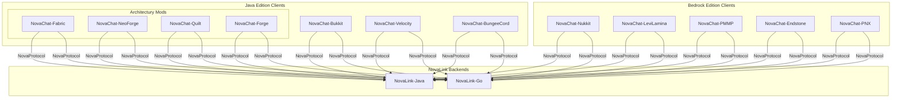
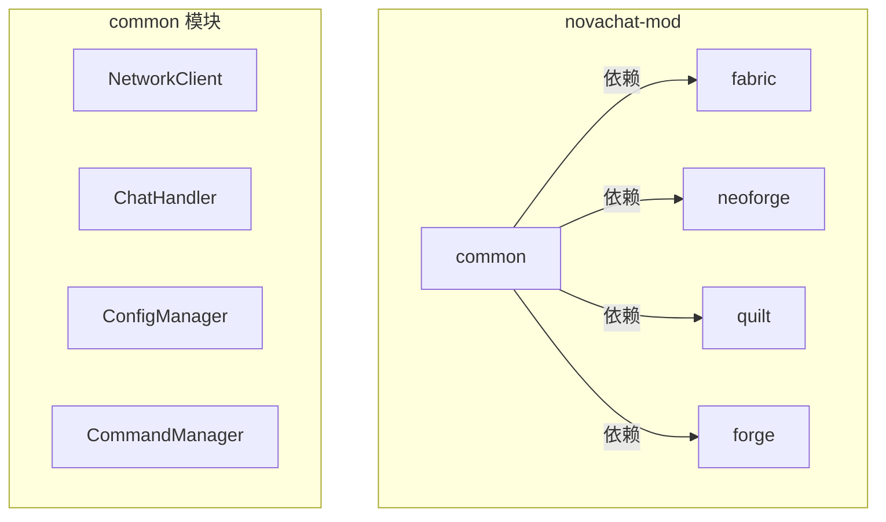
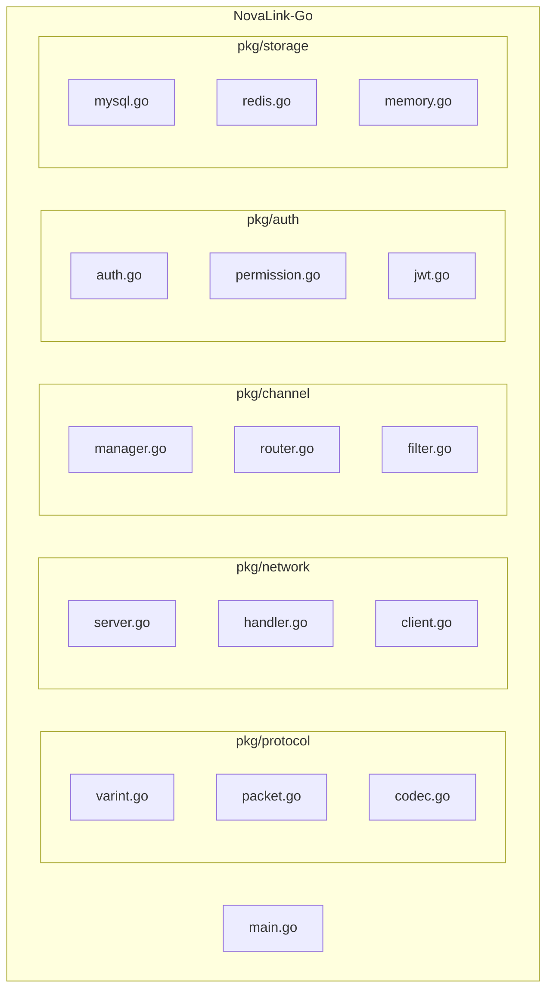

# Design Document

## Overview

本设计文档描述 NovaChat 平台扩展的技术架构，包括：
1. Java Edition Mod 支持（Fabric/NeoForge/Quilt/Forge）
2. Bedrock Edition 扩展（PocketMine-MP/Endstone/PowerNukkitX）
3. Go 版本后端（NovaLink-Go）
4. 测试覆盖增强

### 设计目标

1. **代码复用**: 使用 Architectury 框架最大化 Mod 代码复用
2. **协议兼容**: 所有平台使用统一的 NovaProtocol
3. **功能对等**: Go 版本后端与 Java 版本功能完全一致
4. **测试完备**: 建立完整的单元测试、属性测试和集成测试体系

### 构建系统架构

项目采用统一的 Gradle 构建系统（Java 项目）+ 多语言构建系统方案：

| 项目 | 构建系统 | 说明 |
|-----|--------|------|
| novalink-core、novachat-common、novachat-bukkit、novachat-velocity、novachat-bungee、novachat-nukkit | Gradle | 迁移自 Maven，使用统一的 Gradle 构建 |
| novachat-mod (Architectury) | Gradle | Architectury 框架原生支持 Gradle |
| novachat-pnx (PowerNukkitX) | Gradle | Mod 项目，使用 Gradle 构建 |
| novalink-go | Go Modules | Go 后端项目 |
| novachat-pmmp | Composer | PHP 项目 |
| novachat-endstone | Poetry | Python 项目 |

## Architecture

### 整体架构图



### Architectury Mod 架构



### NovaLink-Go 架构



## Components and Interfaces

### 1. Architectury Common Module

#### 1.1 NetworkClient (跨平台)
```java
// common/src/main/java/com/nova/chat/mod/network/NetworkClient.java
public interface NetworkClient {
    CompletableFuture<Boolean> connect(String host, int port);
    void disconnect();
    void sendPacket(Packet packet);
    void registerHandler(Class<? extends Packet> type, PacketHandler handler);
    boolean isConnected();
}
```

#### 1.2 ChatHandler (跨平台)
```java
// common/src/main/java/com/nova/chat/mod/chat/ChatHandler.java
public interface ChatHandler {
    void onPlayerChat(UUID playerId, String playerName, String message);
    void displayMessage(UUID playerId, String formattedMessage);
    void setMode(ChatMode mode);
}
```

#### 1.3 Platform Abstraction
```java
// common/src/main/java/com/nova/chat/mod/platform/Platform.java
public interface Platform {
    void registerChatListener(ChatHandler handler);
    void registerCommands(CommandManager manager);
    void sendMessage(UUID playerId, Component message);
    void broadcastMessage(Component message);
    String getCurrentWorld(UUID playerId);
}
```

### 2. NovaLink-Go Components

#### 2.1 Protocol Package
```go
// pkg/protocol/varint.go
package protocol

func WriteVarInt(buf *bytes.Buffer, value int32) error
func ReadVarInt(reader io.Reader) (int32, error)
func VarIntSize(value int32) int
```

#### 2.2 Network Package
```go
// pkg/network/server.go
package network

type Server struct {
    listener net.Listener
    clients  map[string]*ClientConnection
    handler  PacketHandler
}

func NewServer(config *config.ServerConfig) *Server
func (s *Server) Start() error
func (s *Server) Stop() error
func (s *Server) Broadcast(packet protocol.Packet)
```

#### 2.3 Channel Package
```go
// pkg/channel/manager.go
package channel

type Manager struct {
    channels map[string]*Channel
    router   *Router
}

func NewManager() *Manager
func (m *Manager) CreateChannel(config ChannelConfig) (*Channel, error)
func (m *Manager) DeleteChannel(id string) error
func (m *Manager) RouteMessage(msg *ChatMessage) []string
```

### 3. PocketMine-MP Plugin

#### 3.1 Main Plugin Class
```php
// src/NovaChat/NovaChatPlugin.php
namespace NovaChat;

use pocketmine\plugin\PluginBase;

class NovaChatPlugin extends PluginBase {
    private NetworkClient $networkClient;
    private ChatHandler $chatHandler;
    
    public function onEnable(): void;
    public function onDisable(): void;
}
```

#### 3.2 Protocol Implementation
```php
// src/NovaChat/Protocol/VarInt.php
namespace NovaChat\Protocol;

class VarInt {
    public static function write(int $value): string;
    public static function read(string $buffer, int &$offset): int;
}
```

### 4. Endstone Plugin

#### 4.1 Main Plugin Class
```python
# novachat_endstone/plugin.py
from endstone.plugin import Plugin

class NovaChatPlugin(Plugin):
    def __init__(self):
        self.network_client: NetworkClient = None
        self.chat_handler: ChatHandler = None
    
    def on_enable(self) -> None: ...
    def on_disable(self) -> None: ...
```

#### 4.2 Protocol Implementation
```python
# novachat_endstone/protocol/varint.py
import struct

def write_varint(value: int) -> bytes: ...
def read_varint(buffer: bytes, offset: int = 0) -> tuple[int, int]: ...
```

### 5. PowerNukkitX Plugin

PowerNukkitX 插件基于 Java 17+，可以直接复用 novachat-common 模块的协议实现。

#### 5.1 Main Plugin Class
```java
// src/main/java/com/nova/chat/pnx/NovaChatPNX.java
package com.nova.chat.pnx;

import cn.nukkit.plugin.PluginBase;

public class NovaChatPNX extends PluginBase {
    private NetworkClient networkClient;
    private ChatInterceptor chatInterceptor;
    private NovaChatConfig config;
    private WorldMonitor worldMonitor;
    
    @Override
    public void onEnable() {
        // 加载配置
        // 初始化网络客户端
        // 注册事件监听器
        // 注册命令
    }
    
    @Override
    public void onDisable() {
        // 断开连接
        // 清理资源
    }
}
```

#### 5.2 Chat Interceptor
```java
// src/main/java/com/nova/chat/pnx/chat/ChatInterceptor.java
package com.nova.chat.pnx.chat;

import cn.nukkit.event.EventHandler;
import cn.nukkit.event.Listener;
import cn.nukkit.event.player.PlayerChatEvent;

public class ChatInterceptor implements Listener {
    @EventHandler
    public void onPlayerChat(PlayerChatEvent event) {
        // 拦截聊天消息
        // 转发到后端
    }
}
```

#### 5.3 Form UI Manager
```java
// src/main/java/com/nova/chat/pnx/form/ChannelFormManager.java
package com.nova.chat.pnx.form;

import cn.nukkit.form.window.FormWindowSimple;
import cn.nukkit.form.window.FormWindowCustom;

public class ChannelFormManager {
    public void showChannelList(Player player) {
        // 显示频道列表表单
    }
    
    public void showChannelJoin(Player player, String channelId) {
        // 显示加入频道表单（输入密码等）
    }
}
```

## Data Models

### 1. Mod Configuration Model

```java
// common/src/main/java/com/nova/chat/mod/config/ModConfig.java
public class ModConfig {
    private BackendConfig backend;
    private ChatConfig chat;
    private Map<String, String> formats;
    private boolean debug;
}

public class BackendConfig {
    private String host;
    private int port;
    private String username;
    private String password;
    private int reconnectDelay;
}
```

### 2. NovaLink-Go Models

```go
// pkg/model/channel.go
package model

type Channel struct {
    ID           string            `json:"id"`
    DisplayName  string            `json:"display_name"`
    Scope        ChannelScope      `json:"scope"`
    ClientID     string            `json:"client_id,omitempty"`
    Permission   string            `json:"permission,omitempty"`
    MaxCapacity  int               `json:"max_capacity"`
    AllowedWorlds []string         `json:"allowed_worlds,omitempty"`
    Password     string            `json:"password,omitempty"`
    OwnerID      string            `json:"owner_id,omitempty"`
    Members      map[string]bool   `json:"members"`
}

type ChannelScope string

const (
    ScopeGlobal  ChannelScope = "GLOBAL"
    ScopeServer  ChannelScope = "SERVER"
    ScopePrivate ChannelScope = "PRIVATE"
)
```

### 3. Cross-Language Packet Format

所有平台必须实现相同的数据包格式：

| Packet | ID | Fields |
|--------|-----|--------|
| Handshake | 0x01 | protocolVersion(int), clientId(string), passwordHash(string), platform(byte) |
| HandshakeResponse | 0x02 | success(bool), errorCode(string), configJson(string) |
| ChatMessage | 0x03 | senderId(uuid), senderName(string), clientId(string), channelId(string), content(string) |
| ChannelAction | 0x04 | action(byte), channelId(string), password(string), extra(json) |
| KeepAlive | 0x07 | timestamp(long) |

## Correctness Properties

*A property is a characteristic or behavior that should hold true across all valid executions of a system-essentially, a formal statement about what the system should do. Properties serve as the bridge between human-readable specifications and machine-verifiable correctness guarantees.*

Based on the prework analysis, the following correctness properties have been identified:

### Property 1: VarInt Encoding Round-Trip (Cross-Language)
*For any* valid integer value within VarInt range, encoding in one language (Java/Go/PHP/Python) and decoding in another should produce the original value.
**Validates: Requirements 9.1, 11.1, 13.2**

### Property 2: Packet Serialization Round-Trip (Cross-Language)
*For any* valid packet, serializing in one language and deserializing in another should produce an equivalent packet object.
**Validates: Requirements 9.2, 11.2, 13.3, 12.2**

### Property 3: Byte Order Consistency
*For any* multi-byte value, all implementations should produce identical byte sequences when serialized.
**Validates: Requirements 9.3**

### Property 4: Go-Java Protocol Compatibility
*For any* packet sent from a NovaChat client, both NovaLink-Java and NovaLink-Go should parse it identically and produce the same response.
**Validates: Requirements 19.1-19.5**

### Property 5: Go Message Routing Scope Isolation
*For any* SERVER-scoped channel in NovaLink-Go, messages should only be delivered to players connected through the same client.
**Validates: Requirements 14.1-14.5**

### Property 6: Go Authentication Hash Consistency
*For any* password, the SHA-256 hash computed by NovaLink-Go should match the hash computed by NovaLink-Java.
**Validates: Requirements 15.1**

### Property 7: Go Permission Hierarchy Enforcement
*For any* operation in NovaLink-Go requiring a specific permission level, users with lower permission levels should receive NC-403 error.
**Validates: Requirements 15.2**

### Property 8: Go IP Ban After Consecutive Failures
*For any* IP address in NovaLink-Go, after exactly 3 consecutive authentication failures, the IP should be temporarily banned.
**Validates: Requirements 15.3**

### Property 9: Go JWT Token Round-Trip
*For any* valid claims, generating a JWT token and verifying it should return the original claims.
**Validates: Requirements 15.5**

### Property 10: Go Player State Persistence Round-Trip
*For any* player state in NovaLink-Go, saving to database and loading back should produce an equivalent state object.
**Validates: Requirements 16.1-16.5**

### Property 11: Go Mute Duration Enforcement
*For any* muted player in NovaLink-Go, they should be unable to send messages until the mute expires.
**Validates: Requirements 17.1**

### Property 12: Mod Configuration Parsing Round-Trip
*For any* valid mod configuration, serializing to YAML and parsing back should produce an equivalent configuration object.
**Validates: Requirements 6.1**

### Property 13: Cron Schedule Correctness
*For any* valid cron expression, the next execution time should be correctly calculated.
**Validates: Requirements 22.1**

### Property 14: Webhook Event Distribution
*For any* event, all registered webhooks with matching event types should receive the event.
**Validates: Requirements 22.2**

### Property 15: JWT Service Consistency
*For any* valid payload, generating a token and verifying it should return the original payload.
**Validates: Requirements 22.3**

## Error Handling

### Error Code System (Extended)

| Code Range | Category | Description |
|------------|----------|-------------|
| NC-400 | Bad Request | 请求参数错误 |
| NC-401 | Unauthorized | 认证失败 |
| NC-403 | Forbidden | 权限不足 |
| NC-404 | Not Found | 资源不存在 |
| NC-409 | Conflict | 资源冲突 |
| NC-410 | Gone | 邀请码过期 |
| NC-411 | Used | 邀请码已使用 |
| NC-420 | Protocol Mismatch | 协议版本不匹配 |
| NC-429 | Too Many Requests | 请求过于频繁 |
| NC-500 | Internal Error | 服务器内部错误 |
| NC-503 | Service Unavailable | 服务不可用 |

### Cross-Language Error Handling

所有语言实现必须：
1. 使用相同的错误代码体系
2. 返回相同格式的错误响应
3. 记录错误到日志文件

## Testing Strategy

### Dual Testing Approach

本项目采用单元测试和属性测试相结合的测试策略：

- **单元测试**: 验证具体示例和边界情况
- **属性测试**: 验证在所有有效输入上都应成立的通用属性
- **集成测试**: 验证端到端通信正确性

### Property-Based Testing Frameworks

| Language | Framework | Configuration |
|----------|-----------|---------------|
| Java | jqwik | 100+ iterations per property |
| Go | gopter | 100+ iterations per property |
| PHP | Eris | 100+ iterations per property |
| Python | Hypothesis | 100+ iterations per property |

### Cross-Language Protocol Tests

为验证跨语言协议兼容性，需要：

1. **Golden File Tests**: 预生成的二进制数据包文件，所有语言实现必须能正确解析
2. **Round-Trip Tests**: 在不同语言间进行序列化/反序列化测试
3. **Interop Tests**: 实际连接测试，验证不同语言客户端与后端的通信

### Test Annotation Format

每个属性测试必须使用以下格式的注释标记：

```java
// **Feature: novachat-platform-expansion, Property {number}: {property_text}**
```

```go
// **Feature: novachat-platform-expansion, Property {number}: {property_text}**
```

```php
// **Feature: novachat-platform-expansion, Property {number}: {property_text}**
```

```python
# **Feature: novachat-platform-expansion, Property {number}: {property_text}**
```

### Integration Test Framework

```java
// 使用 Testcontainers 进行集成测试
@Testcontainers
class NovaLinkIntegrationTest {
    @Container
    static MySQLContainer<?> mysql = new MySQLContainer<>("mysql:8.0");
    
    @Container
    static GenericContainer<?> redis = new GenericContainer<>("redis:7");
    
    @Test
    void testClientAuthentication() {
        // 启动嵌入式 NovaLink
        // 模拟客户端连接
        // 验证认证流程
    }
}
```

## Project Structure

### Architectury Mod Project

```
novachat-mod/
├── build.gradle
├── settings.gradle
├── gradle.properties
├── common/
│   ├── build.gradle
│   └── src/main/java/com/nova/chat/mod/
│       ├── NovaChatMod.java
│       ├── config/
│       │   └── ModConfig.java
│       ├── network/
│       │   ├── NetworkClient.java
│       │   └── PacketHandler.java
│       ├── chat/
│       │   └── ChatHandler.java
│       ├── command/
│       │   └── CommandManager.java
│       └── platform/
│           └── Platform.java
├── fabric/
│   ├── build.gradle
│   └── src/main/java/com/nova/chat/mod/fabric/
│       ├── NovaChatFabric.java
│       └── FabricPlatform.java
├── neoforge/
│   ├── build.gradle
│   └── src/main/java/com/nova/chat/mod/neoforge/
│       ├── NovaChatNeoForge.java
│       └── NeoForgePlatform.java
├── quilt/
│   ├── build.gradle
│   └── src/main/java/com/nova/chat/mod/quilt/
│       ├── NovaChatQuilt.java
│       └── QuiltPlatform.java
└── forge/
    ├── build.gradle
    └── src/main/java/com/nova/chat/mod/forge/
        ├── NovaChatForge.java
        └── ForgePlatform.java
```

### NovaLink-Go Project

```
novalink-go/
├── go.mod
├── go.sum
├── main.go
├── cmd/
│   └── novalink/
│       └── main.go
├── pkg/
│   ├── protocol/
│   │   ├── varint.go
│   │   ├── varint_test.go
│   │   ├── packet.go
│   │   ├── packet_test.go
│   │   └── codec.go
│   ├── network/
│   │   ├── server.go
│   │   ├── handler.go
│   │   └── client.go
│   ├── channel/
│   │   ├── manager.go
│   │   ├── router.go
│   │   └── filter.go
│   ├── auth/
│   │   ├── auth.go
│   │   ├── permission.go
│   │   └── jwt.go
│   ├── storage/
│   │   ├── provider.go
│   │   ├── mysql.go
│   │   ├── redis.go
│   │   └── memory.go
│   ├── mute/
│   │   └── manager.go
│   ├── filter/
│   │   └── sensitive.go
│   └── config/
│       └── config.go
├── internal/
│   └── ...
└── test/
    ├── protocol_test.go
    └── integration_test.go
```

### PocketMine-MP Plugin

```
novachat-pmmp/
├── composer.json
├── plugin.yml
├── src/
│   └── NovaChat/
│       ├── NovaChatPlugin.php
│       ├── Protocol/
│       │   ├── VarInt.php
│       │   ├── Packet.php
│       │   └── PacketBuffer.php
│       ├── Network/
│       │   └── NetworkClient.php
│       ├── Chat/
│       │   └── ChatHandler.php
│       ├── Command/
│       │   └── NovaChatCommand.php
│       └── Config/
│           └── ConfigManager.php
└── resources/
    └── config.yml
```

### Endstone Plugin

```
novachat-endstone/
├── pyproject.toml
├── plugin.toml
├── novachat_endstone/
│   ├── __init__.py
│   ├── plugin.py
│   ├── protocol/
│   │   ├── __init__.py
│   │   ├── varint.py
│   │   ├── packet.py
│   │   └── buffer.py
│   ├── network/
│   │   ├── __init__.py
│   │   └── client.py
│   ├── chat/
│   │   ├── __init__.py
│   │   └── handler.py
│   ├── command/
│   │   ├── __init__.py
│   │   └── commands.py
│   └── config/
│       ├── __init__.py
│       └── manager.py
└── tests/
    ├── test_protocol.py
    └── test_integration.py
```

### PowerNukkitX Plugin

```
novachat-pnx/
├── pom.xml
├── src/
│   └── main/
│       ├── java/
│       │   └── com/nova/chat/pnx/
│       │       ├── NovaChatPNX.java
│       │       ├── chat/
│       │       │   ├── ChatInterceptor.java
│       │       │   ├── ChatMode.java
│       │       │   ├── MessageFormatter.java
│       │       │   └── PlayerChatState.java
│       │       ├── command/
│       │       │   ├── NovaChatCommand.java
│       │       │   ├── AbstractSubCommand.java
│       │       │   └── ... (子命令)
│       │       ├── config/
│       │       │   └── NovaChatConfig.java
│       │       ├── form/
│       │       │   └── ChannelFormManager.java
│       │       ├── network/
│       │       │   ├── NetworkClient.java
│       │       │   └── ClientChannelHandler.java
│       │       └── world/
│       │           └── WorldMonitor.java
│       └── resources/
│           ├── plugin.yml
│           └── config.yml
└── target/
```

## Configuration Examples

### Mod Configuration (config/novachat.yml)

```yaml
# NovaChat Mod 配置文件
# 适用于 Fabric/NeoForge/Quilt/Forge

backend:
  host: "127.0.0.1"
  port: 8888
  username: "ModServer"
  password: "your-password"
  reconnect-delay: 5

chat:
  replace_vanilla: false
  default_channel: "local"

format:
  channels:
    global: "&c[全服] &7{player}&f: {message}"
    local: "&e[本地] &7{player}&f: {message}"
  default: "&7[{channel_name}] {player}&f: {message}"

debug: false
```

### NovaLink-Go Configuration (novalink.yml)

与 Java 版本使用完全相同的配置文件格式，确保互操作性。

### PowerNukkitX Configuration (config.yml)

```yaml
# NovaChat-PNX 配置文件
# 适用于 PowerNukkitX 服务端

backend:
  host: "127.0.0.1"
  port: 8888
  username: "PNXServer"
  password: "your-password"
  reconnect-delay: 5

chat:
  replace_vanilla: false
  default_channel: "local"

format:
  channels:
    global: "§c[全服] §7{player}§f: {message}"
    local: "§e[本地] §7{player}§f: {message}"
  default: "§7[{channel_name}] {player}§f: {message}"

world-routing:
  enabled: true
  mappings:
    world: "local"
    world_nether: "nether"
    world_the_end: "end"

debug: false
```

