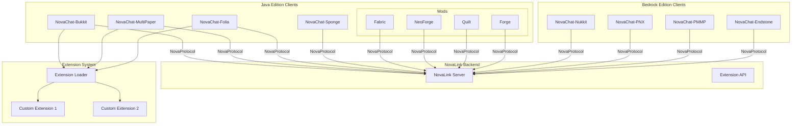
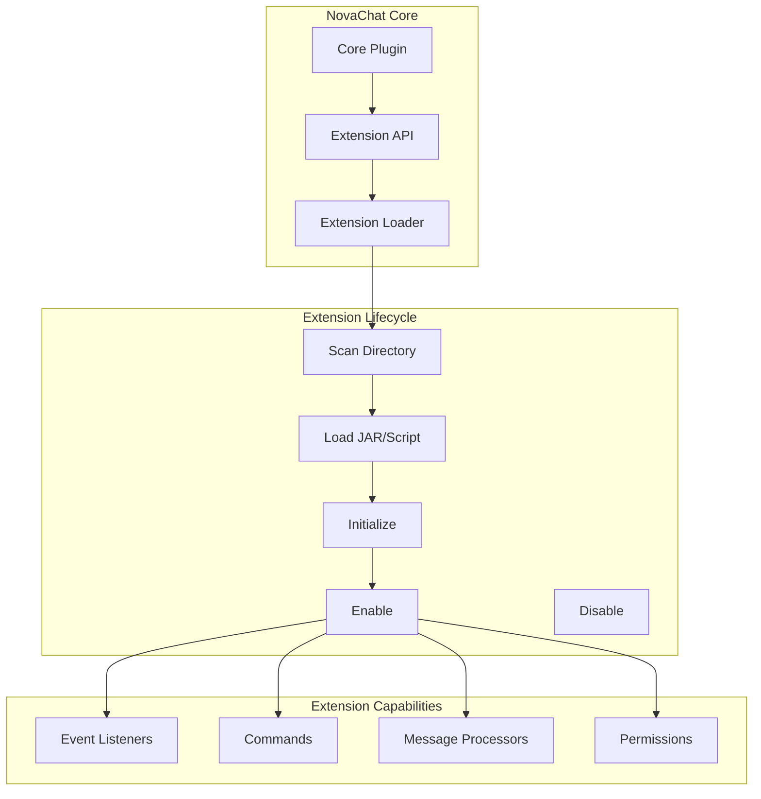
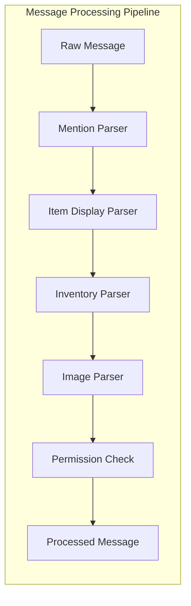

# Design Document

## Overview

本设计文档描述 NovaChat 平台扩展的第二阶段技术架构，包括：
1. 新平台支持（MultiPaper、Folia、Sponge）
2. Mod 多版本支持完善
3. 自定义插件系统
4. 高级聊天功能（@提及、物品/背包/末影箱/图片展示）
5. 权限系统完善

### 设计目标

1. **平台兼容**: 支持更多 Minecraft 服务端平台
2. **可扩展性**: 提供插件系统允许第三方扩展
3. **功能丰富**: 实现现代聊天系统的高级功能
4. **权限精细**: 为所有功能提供细粒度权限控制

## Architecture

### 整体架构图



### 扩展系统架构



### 高级聊天功能架构



## Components and Interfaces

### 1. Extension API

#### 1.1 NovaChatExtension Interface
```java
// novachat-common/src/main/java/com/nova/chat/common/extension/NovaChatExtension.java
public interface NovaChatExtension {
    /**
     * Called when the extension is enabled.
     */
    void onEnable();
    
    /**
     * Called when the extension is disabled.
     */
    void onDisable();
    
    /**
     * Gets the extension metadata.
     */
    ExtensionMeta getMeta();
}
```

#### 1.2 ExtensionMeta
```java
// novachat-common/src/main/java/com/nova/chat/common/extension/ExtensionMeta.java
public class ExtensionMeta {
    private String id;
    private String name;
    private String version;
    private String author;
    private String description;
    private List<String> dependencies;
}
```

#### 1.3 ExtensionLoader
```java
// novachat-common/src/main/java/com/nova/chat/common/extension/ExtensionLoader.java
public interface ExtensionLoader {
    /**
     * Loads all extensions from the extensions directory.
     */
    List<NovaChatExtension> loadExtensions(Path extensionsDir);
    
    /**
     * Enables a specific extension.
     */
    void enableExtension(NovaChatExtension extension);
    
    /**
     * Disables a specific extension.
     */
    void disableExtension(NovaChatExtension extension);
}
```

### 2. Message Processing Components

#### 2.1 MentionParser
```java
// novachat-common/src/main/java/com/nova/chat/common/chat/MentionParser.java
public class MentionParser {
    private static final Pattern MENTION_PATTERN = Pattern.compile("@(\\w+)");
    
    /**
     * Parses mentions from a message.
     * @param message the raw message
     * @return list of mentioned player names
     */
    public List<String> parseMentions(String message);
    
    /**
     * Checks if @all is present in the message.
     */
    public boolean hasAllMention(String message);
}
```

#### 2.2 ItemDisplayParser
```java
// novachat-common/src/main/java/com/nova/chat/common/chat/ItemDisplayParser.java
public class ItemDisplayParser {
    private static final Pattern ITEM_PATTERN = Pattern.compile("\\[(item|i)\\]", Pattern.CASE_INSENSITIVE);
    
    /**
     * Checks if message contains item display tags.
     */
    public boolean hasItemTag(String message);
    
    /**
     * Replaces item tags with display components.
     */
    public String processItemTags(String message, ItemStack heldItem);
}
```

#### 2.3 InventoryDisplayParser
```java
// novachat-common/src/main/java/com/nova/chat/common/chat/InventoryDisplayParser.java
public class InventoryDisplayParser {
    private static final Pattern INV_PATTERN = Pattern.compile("\\[(inv|inventory)\\]", Pattern.CASE_INSENSITIVE);
    private static final Pattern EC_PATTERN = Pattern.compile("\\[(ec|enderchest)\\]", Pattern.CASE_INSENSITIVE);
    
    /**
     * Checks if message contains inventory display tags.
     */
    public boolean hasInventoryTag(String message);
    
    /**
     * Checks if message contains enderchest display tags.
     */
    public boolean hasEnderChestTag(String message);
}
```

#### 2.4 ImageDisplayParser
```java
// novachat-common/src/main/java/com/nova/chat/common/chat/ImageDisplayParser.java
public class ImageDisplayParser {
    private static final Pattern URL_PATTERN = Pattern.compile(
        "https?://[\\w.-]+(?:/[\\w./-]*)?\\.(png|jpg|jpeg|gif|webp)",
        Pattern.CASE_INSENSITIVE
    );
    
    /**
     * Extracts image URLs from a message.
     */
    public List<String> extractImageUrls(String message);
    
    /**
     * Checks if URL is in the whitelist.
     */
    public boolean isWhitelisted(String url, List<String> whitelist);
}
```

### 3. Permission System

#### 3.1 PermissionNode
```java
// novachat-common/src/main/java/com/nova/chat/common/permission/PermissionNode.java
public final class PermissionNode {
    // Command permissions
    public static final String CMD_HELP = "novachat.command.help";
    public static final String CMD_JOIN = "novachat.command.join";
    public static final String CMD_LEAVE = "novachat.command.leave";
    public static final String CMD_CREATE = "novachat.command.create";
    public static final String CMD_INVITE = "novachat.command.invite";
    public static final String CMD_MUTE = "novachat.command.mute";
    public static final String CMD_KICK = "novachat.command.kick";
    public static final String CMD_ANNOUNCE = "novachat.command.announce";
    public static final String CMD_RELOAD = "novachat.command.reload";
    
    // Feature permissions
    public static final String FEATURE_MENTION = "novachat.feature.mention";
    public static final String FEATURE_MENTION_ALL = "novachat.feature.mention.all";
    public static final String FEATURE_ITEM_DISPLAY = "novachat.feature.item";
    public static final String FEATURE_INVENTORY_DISPLAY = "novachat.feature.inventory";
    public static final String FEATURE_ENDERCHEST_DISPLAY = "novachat.feature.enderchest";
    public static final String FEATURE_IMAGE_DISPLAY = "novachat.feature.image";
    
    // Channel permission patterns
    public static String channelJoin(String channelId) {
        return "novachat.channel." + channelId + ".join";
    }
    
    public static String channelSpeak(String channelId) {
        return "novachat.channel." + channelId + ".speak";
    }
    
    public static String channelManage(String channelId) {
        return "novachat.channel." + channelId + ".manage";
    }
    
    // Format permission pattern
    public static String format(String formatGroup) {
        return "novachat.format." + formatGroup;
    }
}
```

### 4. Protocol Extensions

#### 4.1 ItemDisplayPacket
```java
// novachat-common/src/main/java/com/nova/chat/common/protocol/packets/ItemDisplayPacket.java
public class ItemDisplayPacket implements Packet {
    public static final int ID = 0x10;
    
    private UUID senderId;
    private String senderName;
    private String channelId;
    private String itemJson;  // NBT or JSON serialized item
    private long timestamp;
}
```

#### 4.2 InventorySnapshotPacket
```java
// novachat-common/src/main/java/com/nova/chat/common/protocol/packets/InventorySnapshotPacket.java
public class InventorySnapshotPacket implements Packet {
    public static final int ID = 0x11;
    
    private UUID senderId;
    private String senderName;
    private String channelId;
    private String snapshotId;  // Unique ID for this snapshot
    private String inventoryJson;  // Serialized inventory contents
    private InventoryType type;  // PLAYER or ENDERCHEST
    private long timestamp;
}
```

#### 4.3 MentionPacket
```java
// novachat-common/src/main/java/com/nova/chat/common/protocol/packets/MentionPacket.java
public class MentionPacket implements Packet {
    public static final int ID = 0x12;
    
    private UUID mentionerId;
    private String mentionerName;
    private UUID mentionedId;
    private String channelId;
    private String messagePreview;
    private long timestamp;
}
```

#### 4.4 ImageDisplayPacket
```java
// novachat-common/src/main/java/com/nova/chat/common/protocol/packets/ImageDisplayPacket.java
public class ImageDisplayPacket implements Packet {
    public static final int ID = 0x13;
    
    private UUID senderId;
    private String senderName;
    private String channelId;
    private String imageUrl;
    private String imageHash;  // For caching
    private long timestamp;
}
```

### 5. Platform Adapters

#### 5.1 MultiPaper Adapter
```java
// novachat-multipaper/src/main/java/com/nova/chat/multipaper/MultiPaperAdapter.java
public class MultiPaperAdapter {
    /**
     * Detects if running on MultiPaper.
     */
    public static boolean isMultiPaper();
    
    /**
     * Gets the current server instance ID.
     */
    public String getInstanceId();
    
    /**
     * Syncs player state across instances.
     */
    public void syncPlayerState(UUID playerId, PlayerChatState state);
}
```

#### 5.2 Folia Scheduler Adapter
```java
// novachat-folia/src/main/java/com/nova/chat/folia/FoliaSchedulerAdapter.java
public class FoliaSchedulerAdapter {
    /**
     * Runs a task on the correct region thread for a player.
     */
    public void runForPlayer(Player player, Runnable task);
    
    /**
     * Runs an async task.
     */
    public void runAsync(Runnable task);
    
    /**
     * Runs a task on the global region.
     */
    public void runGlobal(Runnable task);
}
```

#### 5.3 Mod Version Adapter
```java
// novachat-mod/common/src/main/java/com/nova/chat/mod/version/VersionAdapter.java
public interface VersionAdapter {
    /**
     * Gets the Minecraft version.
     */
    String getMinecraftVersion();
    
    /**
     * Sends a chat message to a player.
     */
    void sendMessage(ServerPlayer player, Component message);
    
    /**
     * Registers chat event listener.
     */
    void registerChatListener(ChatHandler handler);
}
```

## Data Models

### 1. Extension Metadata (extension.yml)
```yaml
id: my-extension
name: My Custom Extension
version: 1.0.0
author: Developer
description: A custom NovaChat extension
main: com.example.MyExtension
dependencies:
  - novachat-common
```

### 2. Format Groups Configuration
```yaml
# config.yml - Format groups with permissions
format:
  groups:
    vip:
      permission: novachat.format.vip
      priority: 100
      template: "&6[VIP] &e{player}&f: {message}"
    
    staff:
      permission: novachat.format.staff
      priority: 200
      template: "&c[Staff] &b{player}&f: {message}"
    
    default:
      permission: null  # No permission required
      priority: 0
      template: "&7{player}&f: {message}"
```

### 3. Mention Configuration
```yaml
# config.yml - Mention settings
mention:
  enabled: true
  sound: ENTITY_EXPERIENCE_ORB_PICKUP
  title:
    enabled: true
    fade-in: 10
    stay: 40
    fade-out: 10
  highlight-color: "&e"
  all-permission: novachat.feature.mention.all
```

### 4. Display Features Configuration
```yaml
# config.yml - Display features
display:
  item:
    enabled: true
    permission: novachat.feature.item
    format: "&b[{item_name}]"
  
  inventory:
    enabled: true
    permission: novachat.feature.inventory
    format: "&d[{player}'s Inventory]"
    snapshot-duration: 300  # seconds
  
  enderchest:
    enabled: true
    permission: novachat.feature.enderchest
    format: "&5[{player}'s Ender Chest]"
    snapshot-duration: 300
  
  image:
    enabled: true
    permission: novachat.feature.image
    whitelist:
      - imgur.com
      - i.imgur.com
      - cdn.discordapp.com
      - media.discordapp.net
    format: "&a[Image]"
```

## Correctness Properties

*A property is a characteristic or behavior that should hold true across all valid executions of a system-essentially, a formal statement about what the system should do. Properties serve as the bridge between human-readable specifications and machine-verifiable correctness guarantees.*

Based on the prework analysis, the following correctness properties have been identified:

### Property 1: Mention Parsing Consistency
*For any* message string containing @mentions, the MentionParser should correctly identify all mentioned player names regardless of message content or position.
**Validates: Requirements 11.1**

### Property 2: Mention Permission Enforcement
*For any* player without mention permission, @mentions in their messages should be treated as plain text and not trigger notifications.
**Validates: Requirements 11.5**

### Property 3: @all Expansion Correctness
*For any* channel with N members, @all should expand to exactly N mention notifications (excluding the sender).
**Validates: Requirements 11.4**

### Property 4: Item Display Tag Parsing
*For any* message containing [item] or [i] tags, the ItemDisplayParser should correctly identify all tags regardless of case or surrounding text.
**Validates: Requirements 12.1**

### Property 5: Item Serialization Round-Trip
*For any* valid ItemStack, serializing to JSON/NBT and deserializing back should produce an equivalent item with all properties preserved.
**Validates: Requirements 12.2**

### Property 6: Display Permission Enforcement
*For any* player without display permission, [item], [inv], [ec] tags should be treated as plain text.
**Validates: Requirements 12.5, 13.5, 14.5**

### Property 7: Image URL Detection
*For any* message containing image URLs, the ImageDisplayParser should correctly extract all URLs with supported extensions (png, jpg, jpeg, gif, webp).
**Validates: Requirements 15.1, 15.2**

### Property 8: Image Whitelist Enforcement
*For any* image URL not in the whitelist, the system should reject it and treat it as plain text.
**Validates: Requirements 15.4**

### Property 9: Extension Loading Isolation
*For any* set of extensions where one fails to load, all other valid extensions should still load successfully.
**Validates: Requirements 8.5**

### Property 10: Extension Metadata Parsing Round-Trip
*For any* valid extension metadata, serializing to YAML and parsing back should produce an equivalent metadata object.
**Validates: Requirements 8.4**

### Property 11: Permission Node Consistency
*For any* channel ID, the generated permission nodes (join, speak, manage) should follow the pattern novachat.channel.<id>.<action>.
**Validates: Requirements 17.1-17.3**

### Property 12: Format Group Priority
*For any* player with multiple format permissions, the format with the highest priority should be selected.
**Validates: Requirements 18.3**

### Property 13: Display Packet Serialization Round-Trip
*For any* ItemDisplayPacket, InventorySnapshotPacket, or ImageDisplayPacket, serializing and deserializing should produce an equivalent packet.
**Validates: Requirements 19.1-19.4**

### Property 14: Mention Packet Serialization Round-Trip
*For any* MentionPacket, serializing and deserializing should produce an equivalent packet with all fields preserved.
**Validates: Requirements 20.1-20.2**

### Property 15: Cross-Platform Byte Order Consistency
*For any* packet, all platform implementations should produce identical byte sequences when serialized.
**Validates: Requirements 21.1-21.3**

### Property 16: Mod Version Detection Correctness
*For any* supported Minecraft version, the version detector should correctly identify the version and load the appropriate adapter.
**Validates: Requirements 4.4, 5.4, 6.4, 7.4**

### Property 17: Folia Thread Safety
*For any* player operation in Folia, the operation should execute on the correct region thread for that player.
**Validates: Requirements 2.3**

### Property 18: MultiPaper State Synchronization
*For any* player moving between MultiPaper instances, their chat state should be consistent across all instances.
**Validates: Requirements 1.3**

## Error Handling

### Error Codes (Extended)

| Code | Category | Description |
|------|----------|-------------|
| NC-450 | Extension Error | 扩展加载失败 |
| NC-451 | Extension Error | 扩展初始化失败 |
| NC-452 | Extension Error | 扩展依赖缺失 |
| NC-460 | Display Error | 物品序列化失败 |
| NC-461 | Display Error | 背包快照创建失败 |
| NC-462 | Display Error | 图片 URL 不在白名单 |
| NC-470 | Permission Error | 功能权限不足 |
| NC-471 | Permission Error | 频道权限不足 |
| NC-472 | Permission Error | 格式权限不足 |

## Testing Strategy

### Dual Testing Approach

本项目采用单元测试和属性测试相结合的测试策略：

- **单元测试**: 验证具体示例和边界情况
- **属性测试**: 验证在所有有效输入上都应成立的通用属性

### Property-Based Testing Framework

| Language | Framework | Configuration |
|----------|-----------|---------------|
| Java | jqwik | 100+ iterations per property |
| PHP | Eris | 100+ iterations per property |
| Python | Hypothesis | 100+ iterations per property |

### Test Annotation Format

每个属性测试必须使用以下格式的注释标记：

```java
// **Feature: novachat-platform-extensions, Property {number}: {property_text}**
```

## Project Structure

### Extension System Structure

```
novachat-common/
└── src/main/java/com/nova/chat/common/
    ├── extension/
    │   ├── NovaChatExtension.java
    │   ├── ExtensionMeta.java
    │   ├── ExtensionLoader.java
    │   └── ExtensionManager.java
    ├── chat/
    │   ├── MentionParser.java
    │   ├── ItemDisplayParser.java
    │   ├── InventoryDisplayParser.java
    │   └── ImageDisplayParser.java
    └── permission/
        └── PermissionNode.java
```

### New Platform Modules

```
novachat-multipaper/
├── build.gradle
├── src/main/java/com/nova/chat/multipaper/
│   ├── NovaChatMultiPaper.java
│   ├── MultiPaperAdapter.java
│   └── ...
└── src/main/resources/
    ├── plugin.yml
    └── config.yml

novachat-folia/
├── build.gradle
├── src/main/java/com/nova/chat/folia/
│   ├── NovaChatFolia.java
│   ├── FoliaSchedulerAdapter.java
│   └── ...
└── src/main/resources/
    ├── plugin.yml
    └── config.yml

novachat-sponge/
├── build.gradle
├── src/main/java/com/nova/chat/sponge/
│   ├── NovaChatSponge.java
│   └── ...
└── src/main/resources/
    └── mcmod.info
```

