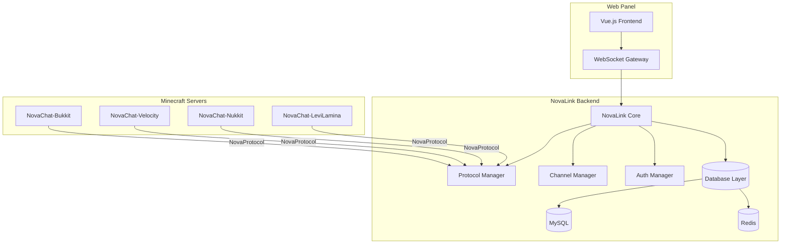
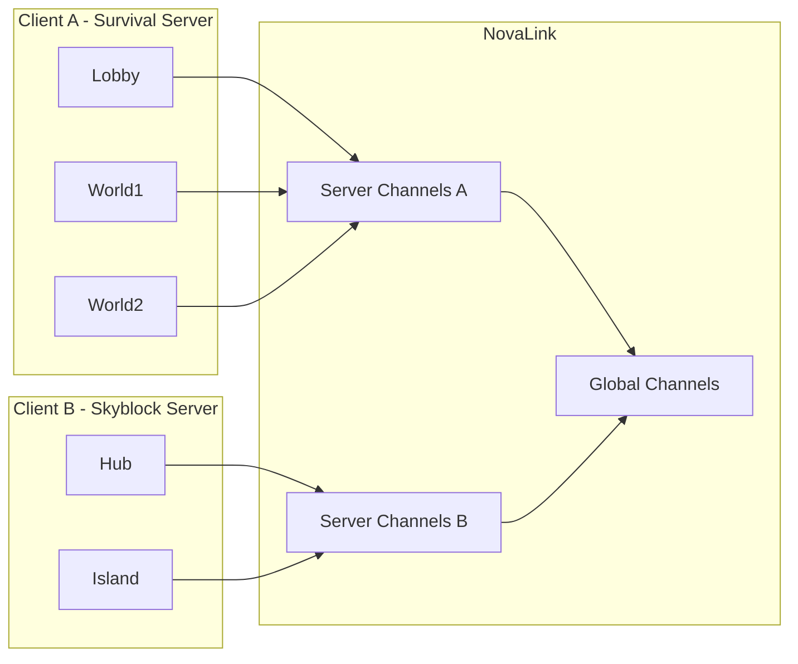

# Design Document

## Overview

NovaChat & NovaLink 是一个分布式跨平台 Minecraft 聊天基础设施系统，采用星型拓扑架构。本设计文档详细描述系统的技术架构、组件设计、数据模型和实现策略。

### 设计目标

1. **高可用性**: 支持多客户端并发连接，单点故障不影响其他客户端
2. **低延迟**: 消息路由延迟 < 100ms
3. **强一致性**: 频道状态在所有节点间保持一致
4. **可扩展性**: 支持水平扩展，轻松添加新客户端和频道
5. **跨平台**: 统一协议支持 Java 和 C++ 客户端

## Architecture

### 系统架构图



### 网络拓扑



## Components and Interfaces

### 1. NovaLink Backend Components

#### 1.1 Protocol Manager
- **职责**: 处理 NovaProtocol 数据包的编解码
- **接口**:
  ```java
  public interface ProtocolManager {
      void registerPacket(int id, Class<? extends Packet> packetClass);
      Packet decode(ByteBuf buf);
      void encode(Packet packet, ByteBuf buf);
  }
  ```

#### 1.2 Channel Manager
- **职责**: 管理频道生命周期、消息路由
- **接口**:
  ```java
  public interface ChannelManager {
      Channel createChannel(ChannelConfig config);
      void deleteChannel(String channelId);
      void routeMessage(ChatMessage message);
      Set<UUID> getChannelMembers(String channelId);
      void addMember(String channelId, UUID playerId);
      void removeMember(String channelId, UUID playerId);
  }
  ```

#### 1.3 Auth Manager
- **职责**: 客户端认证、权限验证
- **接口**:
  ```java
  public interface AuthManager {
      AuthResult authenticate(String username, String passwordHash);
      boolean hasPermission(UUID playerId, String permission);
      void grantSuperAdmin(UUID playerId, String password);
      void revokeSuperAdmin(UUID playerId);
  }
  ```

#### 1.4 Database Layer
- **职责**: 数据持久化抽象层
- **接口**:
  ```java
  public interface DatabaseProvider {
      void savePlayerState(UUID playerId, PlayerState state);
      PlayerState loadPlayerState(UUID playerId);
      void saveChannelConfig(Channel channel);
      List<Channel> loadAllChannels();
  }
  ```

### 2. NovaChat Plugin Components

#### 2.1 Network Client
- **职责**: 与后端建立连接、发送/接收数据包
- **接口**:
  ```java
  public interface NetworkClient {
      CompletableFuture<Boolean> connect(String host, int port);
      void disconnect();
      void sendPacket(Packet packet);
      void registerHandler(Class<? extends Packet> type, PacketHandler handler);
  }
  ```

#### 2.2 Chat Interceptor
- **职责**: 拦截原版聊天事件
- **接口**:
  ```java
  public interface ChatInterceptor {
      void onPlayerChat(PlayerChatEvent event);
      void setMode(ChatMode mode); // HYBRID or REPLACE
  }
  ```

#### 2.3 World Monitor
- **职责**: 监听世界切换事件，实现自动路由
- **接口**:
  ```java
  public interface WorldMonitor {
      void onWorldChange(PlayerChangedWorldEvent event);
      Channel findApplicableChannel(String worldName);
  }
  ```


## Data Models

### 1. Channel Model

```java
// 后端频道模型 (仅存储核心路由信息)
public class Channel {
    private String id;              // 唯一标识符 (如 "NC-5A3F")
    private String displayName;     // 显示名称 (用于后端日志和管理面板)
    private ChannelScope scope;     // GLOBAL, SERVER, PRIVATE
    private String clientId;        // 所属客户端 (SERVER/PRIVATE 频道)
    private String permission;      // 权限节点
    private int maxCapacity;        // 最大容量
    private List<String> allowedWorlds; // 世界过滤器 (可选)
    private String password;        // 密码 (仅 PRIVATE)
    private UUID ownerId;           // 所有者 (仅 PRIVATE)
    private Set<UUID> members;      // 成员列表
    private List<Announcement> announcements; // 公告列表
    // 注意: 消息格式 (format) 在插件端配置，不在后端存储
}

public enum ChannelScope {
    GLOBAL,   // 全网频道
    SERVER,   // 服务器频道
    PRIVATE   // 私有频道
}
```

### 2. Client Model

```java
public class Client {
    private String id;              // 客户端 ID
    private String username;        // 认证用户名
    private String passwordHash;    // 密码哈希 (SHA-256 + Salt)
    private String displayName;     // 显示名称
    private boolean connected;      // 连接状态
    private String ipAddress;       // IP 地址
    private long lastHeartbeat;     // 最后心跳时间
    private Map<String, Channel> channels; // 下属频道
}
```

### 3. Player State Model

```java
public class PlayerState {
    private UUID playerId;          // 玩家 UUID
    private String playerName;      // 玩家名称
    private String clientId;        // 当前客户端
    private String currentWorld;    // 当前世界
    private Set<String> joinedChannels; // 已加入频道
    private String activeChannel;   // 当前活跃频道
    private ChatMode chatMode;      // 聊天模式
    private boolean superAdminAuth; // 超级管理员认证状态
    private Map<String, MuteInfo> mutes; // 禁言信息
}

public class MuteInfo {
    private String channelId;       // 频道 ID (null = 全局)
    private long expireTime;        // 过期时间
    private String reason;          // 禁言原因
    private UUID operatorId;        // 操作者
}
```

### 4. Packet Models

```java
// 握手认证包
public class HandshakePacket extends Packet {
    private int protocolVersion;
    private String clientId;
    private String passwordHash;
    private PlatformType platform;
}

// 聊天消息包
public class ChatMessagePacket extends Packet {
    private UUID senderId;
    private String senderName;
    private String clientId;
    private String channelId;
    private String content;
    private Map<String, String> placeholders;
}

// 配置同步包
public class ConfigSyncPacket extends Packet {
    private String configJson;
    private long timestamp;
}

// 频道操作包
public class ChannelActionPacket extends Packet {
    private ChannelAction action; // JOIN, LEAVE, CREATE, DELETE
    private String channelId;
    private String password;
    private Map<String, Object> extra;
}
```

## NovaProtocol Specification

### 帧结构

| 字段 | 类型 | 长度 | 说明 |
|-----|------|------|------|
| Length | VarInt | 1-5 bytes | 数据包体总长度 |
| PacketID | Byte | 1 byte | 数据包类型标识 |
| RequestID | UUID | 16 bytes | 请求追踪 ID |
| Payload | Byte[] | N bytes | 业务数据负载 |

### 数据包类型

| ID | 名称 | 方向 | 说明 |
|----|------|------|------|
| 0x01 | Handshake | C→S | 握手认证 |
| 0x02 | HandshakeResponse | S→C | 认证响应 |
| 0x03 | ChatMessage | 双向 | 聊天消息 |
| 0x04 | ChannelAction | C→S | 频道操作 |
| 0x05 | ChannelActionResponse | S→C | 操作响应 |
| 0x06 | ConfigSync | S→C | 配置同步 |
| 0x07 | KeepAlive | 双向 | 心跳包 |
| 0x08 | PlayerState | 双向 | 玩家状态同步 |
| 0x09 | Title | S→C | Title 消息 |
| 0x0A | Announcement | S→C | 公告消息 |
| 0x0B | AdminAction | C→S | 管理操作 |

### 字节序

- 网络传输统一使用大端序 (Big-Endian)
- C++ 客户端需要进行字节序转换


## Correctness Properties

*A property is a characteristic or behavior that should hold true across all valid executions of a system-essentially, a formal statement about what the system should do. Properties serve as the bridge between human-readable specifications and machine-verifiable correctness guarantees.*

Based on the prework analysis, the following correctness properties have been identified:

### Property 1: Authentication Hash Consistency
*For any* username and password combination, computing the SHA-256 hash twice should produce identical results.
**Validates: Requirements 1.1**

### Property 2: Authentication Success/Failure Determinism
*For any* client credentials, if the credentials match the backend configuration, authentication should succeed; otherwise, it should fail with NC-401.
**Validates: Requirements 1.2, 1.3**

### Property 3: IP Ban After Consecutive Failures
*For any* IP address, after exactly 3 consecutive authentication failures, the IP should be temporarily banned.
**Validates: Requirements 1.5**

### Property 4: Permission Hierarchy Enforcement
*For any* operation requiring a specific permission level, users with lower permission levels should receive NC-403 error.
**Validates: Requirements 2.7**

### Property 5: Message Routing Scope Isolation
*For any* SERVER-scoped channel, messages should only be delivered to players connected through the same client, never crossing client boundaries.
**Validates: Requirements 3.2, 3.5, 5.3**

### Property 6: Player State Persistence Round-Trip
*For any* player state, saving to database and loading back should produce an equivalent state object.
**Validates: Requirements 3.3, 22.1, 22.4**

### Property 7: Global Channel Cross-Client Routing
*For any* GLOBAL-scoped channel message, all online players with the required permission across all clients should receive the message.
**Validates: Requirements 4.3**

### Property 8: World Filter Membership
*For any* channel with `allowed_worlds` configured, a player should be a member if and only if their current world is in the allowed list.
**Validates: Requirements 6.1, 6.2, 6.3, 6.4**

### Property 9: Private Channel ID Uniqueness
*For any* two private channels created, their generated IDs should be different.
**Validates: Requirements 7.2**

### Property 10: Private Channel Client Isolation
*For any* private channel, only players connected through the same client as the channel owner should be able to join.
**Validates: Requirements 7.4, 7.6**

### Property 11: Invitation Code Validity
*For any* invitation code, it should be valid for exactly 24 hours after generation, and invalid after being used once.
**Validates: Requirements 8.2, 8.4**

### Property 12: Auto-Routing World Change
*For any* player changing worlds, they should automatically join the most specific applicable channel for the new world.
**Validates: Requirements 9.1, 9.3**

### Property 13: Color Code Parsing Round-Trip
*For any* message with color codes, parsing and re-serializing should preserve the color information.
**Validates: Requirements 10.2, 10.3**

### Property 14: Sensitive Word Filtering
*For any* message containing words from the filter list, those words should be replaced with `***` in the output.
**Validates: Requirements 12.1**

### Property 15: Mute Duration Enforcement
*For any* muted player, they should be unable to send messages until the mute expires, and able to send immediately after expiration.
**Validates: Requirements 13.2, 13.6**

### Property 16: Configuration Parsing Round-Trip
*For any* valid configuration, serializing to YAML and parsing back should produce an equivalent configuration object.
**Validates: Requirements 20.1-20.6**

### Property 17: Template Inheritance
*For any* channel using a template, the channel should inherit all template properties except those explicitly overridden.
**Validates: Requirements 5.5**

## Error Handling

### Error Code System

| Code Range | Category | Description |
|------------|----------|-------------|
| NC-400 | Bad Request | 请求参数错误 |
| NC-401 | Unauthorized | 认证失败 |
| NC-403 | Forbidden | 权限不足 |
| NC-404 | Not Found | 资源不存在 |
| NC-409 | Conflict | 资源冲突 |
| NC-410 | Gone | 邀请码过期 |
| NC-411 | Used | 邀请码已使用 |
| NC-429 | Too Many Requests | 请求过于频繁 |
| NC-500 | Internal Error | 服务器内部错误 |
| NC-503 | Service Unavailable | 服务不可用 |

### Error Response Format

```java
public class ErrorResponse {
    private String code;        // 错误代码
    private String message;     // 错误消息
    private String suggestion;  // 解决建议
    private long timestamp;     // 时间戳
}
```

### Retry Strategy

- 网络错误: 指数退避重试 (1s, 2s, 4s, 8s, max 30s)
- 认证错误: 不重试，提示用户检查配置
- 权限错误: 不重试，提示用户联系管理员


## Testing Strategy

### Dual Testing Approach

本项目采用单元测试和属性测试相结合的测试策略：

- **单元测试**: 验证具体示例和边界情况
- **属性测试**: 验证在所有有效输入上都应成立的通用属性

### Property-Based Testing Framework

- **Java (NovaLink Backend)**: JUnit 5 + jqwik
- **Java (NovaChat Plugins)**: JUnit 5 + jqwik
- **C++ (NovaChat-LeviLamina)**: Catch2 + RapidCheck

### Test Categories

#### 1. Protocol Tests
- 数据包编解码正确性
- 字节序转换正确性
- VarInt 编解码

#### 2. Channel Logic Tests
- 频道创建/删除
- 成员加入/退出
- 消息路由
- 世界过滤器

#### 3. Authentication Tests
- 密码哈希验证
- IP 封禁逻辑
- 权限层级验证

#### 4. State Persistence Tests
- 玩家状态保存/恢复
- 频道配置持久化
- 数据库 round-trip

### Property Test Configuration

```java
// jqwik 配置示例
@Property(tries = 100)
void messageRoutingScopeIsolation(
    @ForAll @From("serverChannels") Channel channel,
    @ForAll @From("players") List<Player> players,
    @ForAll @From("chatMessages") ChatMessage message
) {
    // Property 5: Message Routing Scope Isolation
    // **Feature: starchat-starlink, Property 5: Message Routing Scope Isolation**
    Set<Player> recipients = channelManager.routeMessage(channel, message);
    
    for (Player recipient : recipients) {
        assertThat(recipient.getClientId())
            .isEqualTo(channel.getClientId());
    }
}
```

### Test Annotation Format

每个属性测试必须使用以下格式的注释标记：

```java
// **Feature: starchat-starlink, Property {number}: {property_text}**
```

## Configuration Examples

### NovaLink Backend Configuration (novalink.yml)

```yaml
# ==========================================
# NovaLink 后端配置文件
# ==========================================

# 服务器设置
server:
  bind-address: 0.0.0.0
  port: 8888
  websocket-port: 8889
  secret-key: "your-secret-key-here"
  worker-threads: 4

# 数据库设置
database:
  type: mysql  # mysql, redis, memory
  mysql:
    host: 127.0.0.1
    port: 3306
    database: novalink
    username: root
    password: password
    pool-size: 10
  redis:
    enabled: true
    host: 127.0.0.1
    port: 6379
    password: ""

# 安全设置
security:
  allowed-ips:
    - 127.0.0.1
    - 192.168.1.0/24
  ip-ban-duration: 300  # 秒

# 超级管理员
super-admins:
  - uuid: "00000000-0000-0000-0000-000000000000"
    password-hash: "sha256-hash-here"

# 调试模式
debug: false

# ==========================================
# 全网频道 (GLOBAL Scope)
# ==========================================
# 注意: 消息格式在各插件端的 config.yml 中配置
# 后端仅负责路由和权限验证
global_channels:
  global:
    display_name: "全服"  # 用于后端日志和管理面板
    permission: "novachat.channel.global"
    max_capacity: 1000

# ==========================================
# 频道模板
# ==========================================
templates:
  standard_local:
    display_name: "本地"
    scope: SERVER
    max_capacity: 100

# ==========================================
# 客户端配置
# ==========================================
clients:
  - username: "Survival_Server"
    password: "password_hash_here"
    display_name: "生存服"
    channels:
      # 引用模板
      local:
        use_template: "standard_local"
        display_name: "&e[生存大厅]"
      
      # 世界频道 (带 allowed_worlds)
      resource:
        display_name: "资源区"
        scope: SERVER
        # 注意: 消息格式在插件端 config.yml 中配置
        allowed_worlds:
          - "resource_world"
          - "resource_nether"
      
      # 普通服务器频道
      pvp:
        display_name: "PVP"
        scope: SERVER
        permission: "novachat.channel.pvp"
        # 注意: 消息格式在插件端 config.yml 中配置
```

### NovaChat Plugin Configuration (config.yml)

```yaml
# ==========================================
# NovaChat 插件配置文件
# ==========================================

# 后端连接
backend:
  host: "127.0.0.1"
  port: 8888
  username: "Survival_Server"
  password: "your-password-here"
  reconnect-delay: 5  # 秒

# 聊天设置
chat:
  replace_vanilla: false  # 是否替换原版聊天
  default_channel: "local"  # 默认频道

# ==========================================
# 消息格式 (在插件端配置，服主可自定义)
# ==========================================
# 可用变量:
#   {player} - 玩家名称
#   {display_name} - 玩家显示名称
#   {channel} - 频道ID
#   {channel_name} - 频道显示名称
#   {message} - 消息内容
#   {world} - 玩家所在世界
#   {server} - 服务器名称
#   %placeholder% - PlaceholderAPI 变量
# ==========================================
format:
  # 系统消息格式
  prefix: "&8[&bNovaChat&8]&r "
  error: "&c错误: {message}"
  success: "&a成功: {message}"
  
  # 频道消息格式 (按频道ID配置)
  channels:
    # 全局频道格式
    global: "&c[全服] &7{player}&f: {message}"
    
    # 本地频道格式
    local: "&e[本地] &7{player}&f: {message}"
    
    # 资源区频道格式
    resource: "&a[资源] &7{player}&f: {message}"
    
    # PVP 频道格式
    pvp: "&c[PVP] &7{player}&f: {message}"
    
    # 私有频道默认格式
    private_default: "&d[私聊] &7{player}&f: {message}"
  
  # 默认格式 (未配置的频道使用此格式)
  default: "&7[{channel_name}] {player}&f: {message}"

# 调试模式
debug: false
```

## Web Panel Architecture

### Frontend (Vue.js 3)

```
nova-panel/
├── src/
│   ├── components/
│   │   ├── ChannelList.vue
│   │   ├── PlayerList.vue
│   │   ├── ClientStatus.vue
│   │   └── MessageMonitor.vue
│   ├── views/
│   │   ├── Dashboard.vue
│   │   ├── Channels.vue
│   │   ├── Players.vue
│   │   └── Settings.vue
│   ├── stores/
│   │   ├── auth.ts
│   │   ├── channels.ts
│   │   └── websocket.ts
│   └── api/
│       └── websocket.ts
```

### WebSocket API

```typescript
// 连接认证
interface AuthMessage {
  type: 'auth';
  token: string;
}

// 订阅频道消息
interface SubscribeMessage {
  type: 'subscribe';
  channels: string[];
}

// 实时消息
interface ChatMessage {
  type: 'chat';
  channelId: string;
  sender: string;
  content: string;
  timestamp: number;
}
```
