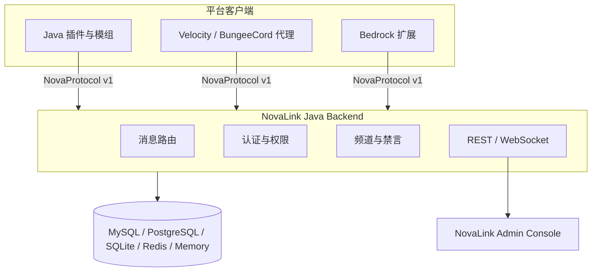

<p align="center">
  
</p>

<h1 align="center">NovaLink</h1>

<p align="center">
  <strong>面向 Minecraft 多端网络的分布式聊天与频道路由基础设施。</strong><br />
  NovaChat 负责平台侧连接，NovaLink 负责统一协议、路由、权限、持久化与运营控制。
</p>

<p align="center">
  <a href="#快速开始">快速开始</a> ·
  <a href="#架构">架构</a> ·
  <a href="#平台与模块">平台与模块</a> ·
  <a href="#部署与配置">部署与配置</a> ·
  <a href="#开发与验证">开发与验证</a>
</p>

<p align="center">
  <a href="LICENSE"></a>
  
  
  
</p>

> **NovaLink is the canonical Java backend.** It is designed to be the routing center for multiple NovaChat clients across Java Edition, Bedrock Edition, proxies, plugins and server-side extensions.

## 为什么是 NovaLink

当一个网络同时运行多个 Java、Bedrock、代理与模组端服务时，聊天通常会分散在各自的插件和平台 API 中。NovaLink 将这些端点收敛到一个星型拓扑：客户端通过 **NovaProtocol v1** 与后端连接，由后端统一处理认证、频道权限、消息路由、禁言状态、持久化与 Web 管理。

| 能力 | 说明 |
| --- | --- |
| **跨平台连接** | 覆盖 Java 插件、代理、Bedrock 扩展与原生端工具链，客户端通过统一协议接入。 |
| **分层频道** | 支持 GLOBAL、SERVER、WORLD 与 PRIVATE 范围；世界过滤和频道权限由配置驱动。 |
| **集中运营** | Java 后端提供路由、认证、持久化与 REST/WebSocket 能力；React 管理面板用于实时观测和控制。 |
| **可选持久化** | 支持 MySQL/MariaDB、PostgreSQL、SQLite、Redis 与内存模式，按部署规模选择。 |
| **可验证交付** | 包含单元测试、属性测试、集成测试，以及可选的真实服务器 E2E 验证基础设施。 |

## 快速开始

下面的路径用于构建并运行 **NovaLink 后端**。默认后端配置文件为工作目录中的 `novalink.yml`；也可以将配置文件路径作为第一个启动参数传入。

### 1. 获取源码并构建后端

```bash
git clone https://github.com/XingLingQAQ/NovaLink.git
cd NovaLink

# Linux / macOS
./gradlew :StarLink:core:shadowJar

# Windows PowerShell
.\gradlew.bat :StarLink:core:shadowJar
```

构建会生成可直接运行的 fat JAR，位置为 `StarLink/core/build/libs/*-all.jar`。该产物已包含 NovaLink 运行所需的后端依赖。

### 2. 创建最小可运行配置

```bash
cp examples/novalink.yml novalink.yml
```

首次部署时，请至少修改 `server.secret-key`、数据库连接信息，以及 `clients` 中的客户端凭据。小型或本地测试环境可先将 `database.type` 设置为 `sqlite` 或 `memory`；生产环境应使用持久化存储并妥善保管密钥。

### 3. 启动 NovaLink

```bash
java -jar StarLink/core/build/libs/*-all.jar

# 使用自定义配置路径
java -jar StarLink/core/build/libs/*-all.jar /opt/novalink/novalink.yml
```

默认示例中的 NovaProtocol TCP 端口为 `8888`，WebSocket 端口为 `8889`。请在防火墙、反向代理和客户端配置中按实际部署环境放行并对齐这些端口。

### 4. 接入一个 NovaChat 客户端

选择与目标平台对应的 NovaChat 模块，将构建产物放入目标服务端的插件、模组或扩展目录。客户端连接参数位于各平台配置中；可从 [`examples/novachat-config.yml`](examples/novachat-config.yml) 开始，并确保主机、端口、用户名与密码同 NovaLink 后端配置一致。

## 架构



NovaLink 的依赖方向保持清晰：共享协议层被后端与全部客户端复用；平台客户端在其之上复用连接运行时；生产后端只依赖共享协议层，从而避免把平台插件逻辑带入中心服务。

## 平台与模块

### 核心模块

| 路径 | 角色 | 说明 |
| --- | --- | --- |
| [`NovaChat/common`](NovaChat/common) | 协议层 | NovaProtocol 数据包、编解码、提及与共享扩展。 |
| [`NovaChat/client-core`](NovaChat/client-core) | 客户端运行时 | 连接生命周期、重连策略与客户端状态；供插件/模组侧复用。 |
| [`StarLink/core`](StarLink/core) | 中心后端 | 规范 Java 后端实现，提供路由、认证、持久化、REST 与 WebSocket。 |
| [`Panel/web`](Panel/web) | 管理面板 | React + Vite 管理界面，用于连接 NovaLink 并查看运行状态。 |
| [`e2e`](e2e) | 真实服务器验证 | 可选的多平台真实服务端与机器人测试编排。 |

### 平台覆盖

| 平台族 | 对应模块或目录 | 接入形态 |
| --- | --- | --- |
| Bukkit / Spigot / Paper / Folia | `NovaChat/Plugin` | Java 服务端插件。 |
| Velocity / BungeeCord | `NovaChat/Proxy` | Java 代理端插件。 |
| Fabric / NeoForge / Quilt | `NovaChat/MOD` | Java 模组端共享层与 Loader 实现。 |
| Nukkit / PowerNukkitX | `NovaChat/Bedrock` | Java Bedrock 服务端插件。 |
| LeviLamina / PocketMine-MP / Endstone | `NovaChat/Bedrock` | C++、PHP 与 Python 生态扩展。 |
| Sponge | `NovaChat/Sponge` | Sponge 平台插件。 |

> 具体的 Minecraft、Loader、JDK 与上游 API 组合会随平台发布节奏变化。部署前请以对应模块的 `build.gradle`、`plugin.yml` 或平台文档为准，并在目标环境完成验证。

## 频道模型

| 范围 | 适用场景 | 路由边界 |
| --- | --- | --- |
| `GLOBAL` | 全网公告、跨服公共聊天 | 所有已授权并连接的客户端。 |
| `SERVER` | 单服务端本地频道 | 指定 NovaChat 客户端内。 |
| `WORLD` | 资源世界、PVP 世界、子世界聊天 | 指定服务端及 `allowed_worlds` 范围。 |
| `PRIVATE` | 玩家创建或受控的私密会话 | 频道成员与权限边界内。 |

频道、模板、客户端与全局权限均由 `novalink.yml` 定义。完整字段请直接参考 [`examples/novalink.yml`](examples/novalink.yml)，不要将示例中的密码、JWT 密钥或 Webhook 地址直接用于生产。

## 部署与配置

### 后端运行要求

| 组件 | 最低要求 | 备注 |
| --- | --- | --- |
| NovaLink 后端 | Java 17 | `StarLink/core` 的生产后端与 fat JAR 运行路径。 |
| 数据库 | 可选 | 支持 MySQL/MariaDB、PostgreSQL、SQLite、Redis 与内存模式。 |
| Web 管理面板 | Node.js 与 npm | 仅在开发、构建或自行托管管理面板时需要。 |
| 平台客户端 | 因模块而异 | Java、PHP、Python 或原生工具链要求见对应模块。 |

### 推荐的最小配置

```yaml
server:
  bind-address: 0.0.0.0
  port: 8888
  websocket-port: 8889
  secret-key: "replace-with-a-long-random-secret"

database:
  type: sqlite
  sqlite:
    file-path: data/novalink.db

clients:
  - username: "survival"
    password: "replace-with-a-password-hash"
    display_name: "Survival"
```

示例配置包含 MySQL、PostgreSQL、SQLite、Redis、全局频道、客户端频道模板与功能开关。生产部署建议在上线前完成以下检查：替换所有示例密钥；使用持久化数据库；限制允许访问的 IP/CIDR；仅向可信网络公开管理入口；并为数据库和配置文件建立备份策略。

### Web 管理面板

管理面板位于 [`Panel/web`](Panel/web)。本地开发与生产构建均使用 npm：

```bash
cd Panel/web
npm ci
npm run dev

# 生产构建
npm run build
```

登录页默认将 REST 请求发送至同源 `/api`，并使用当前主机的 `8889` 端口建立 WebSocket 连接；可在 **Advanced Settings** 中为当前会话覆盖这两个地址。将面板部署到生产环境时，应通过反向代理显式配置 API 与 WebSocket 转发，并避免把认证端点暴露在不可信网络中。

## 开发与验证

### 常用命令

| 目标 | 命令 |
| --- | --- |
| 构建全部 Gradle 模块 | `./gradlew build` |
| 执行全部常规检查 | `./gradlew check` |
| 执行 NovaLink 后端测试 | `./gradlew :StarLink:core:test` |
| 生成后端 fat JAR | `./gradlew :StarLink:core:shadowJar` |
| 构建管理面板 | `cd Panel/web && npm run build` |
| 运行真实服务端 E2E | `./gradlew realE2E` |

真实服务端 E2E 为显式选择的验证路径，需要准备真实 Minecraft 服务端文件、机器人进程、Node.js、匹配的 JDK 与平台运行环境。详细的环境、下载校验和平台编排说明见 [`e2e/README.md`](e2e/README.md) 与 [`docs/REAL-SERVER-E2E.md`](docs/REAL-SERVER-E2E.md)。

### 贡献方式

1. 先在 [Issues](https://github.com/XingLingQAQ/NovaLink/issues) 中检索或讨论需求、缺陷和平台兼容性问题。
2. 从 `master` 创建聚焦的分支，并为行为变化补充或调整测试。
3. 在提交 Pull Request 前运行与改动范围相符的 Gradle 或面板构建命令。
4. 在 PR 描述中说明影响的平台、配置变更、验证命令和已知限制。

请勿在公开 Issue、示例配置或测试日志中提交真实密码、JWT 密钥、数据库凭据、私有 IP 或生产环境 Webhook。

## 项目资源

| 资源 | 用途 |
| --- | --- |
| [`examples/novalink.yml`](examples/novalink.yml) | NovaLink 后端完整配置参考。 |
| [`examples/novachat-config.yml`](examples/novachat-config.yml) | NovaChat 客户端配置参考。 |
| [`NovaChat/client-core/DESIGN.md`](NovaChat/client-core/DESIGN.md) | 客户端核心模块的设计与依赖边界。 |
| [`Panel/web`](Panel/web) | Web 管理面板源码与构建入口。 |
| [`e2e/README.md`](e2e/README.md) | 真实服务端 E2E 环境与编排说明。 |
| [`docs`](docs) | 架构、测试、国际化与 UX 审查记录。 |

## 许可证

本项目依据 [MIT License](LICENSE) 发布。
