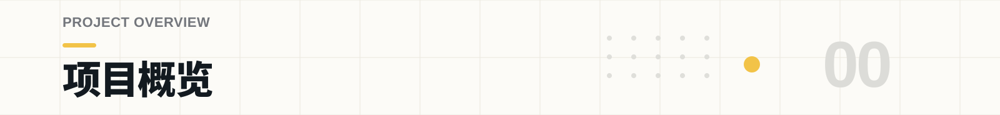
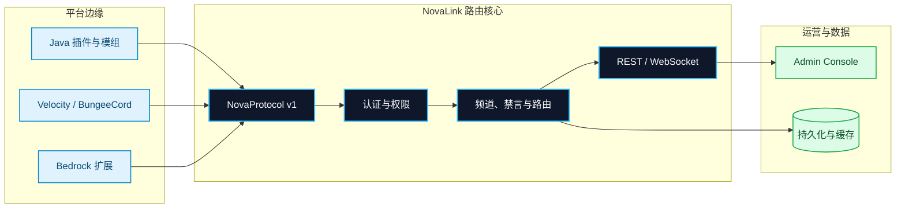
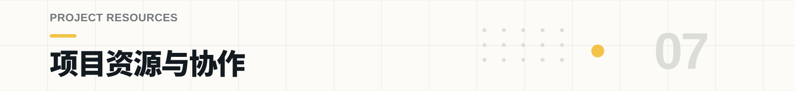
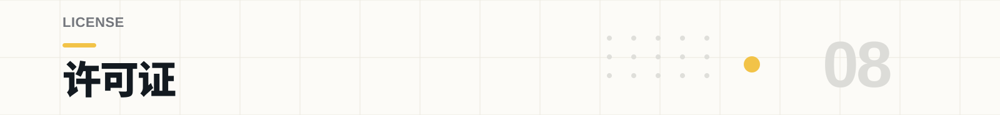

<p align="center">
  
</p>

<h1 align="center">NovaLink</h1>

<p align="center">
  <strong>一套把不同 Minecraft 服务端接入同一个聊天网络的跨服聊天方案。</strong><br />
  中心后端统一处理认证、频道、权限、禁言与路由；各平台通过 NovaChat 接入端连接。
</p>

<p align="center">
  <a href="#overview">项目简介</a> ·
  <a href="#architecture">架构</a> ·
  <a href="#get-started">快速开始</a> ·
  <a href="#system-map">模块</a> ·
  <a href="#channels">频道</a> ·
  <a href="#operations">部署</a> ·
  <a href="#build-verify">开发</a>
</p>

<p align="center">
  <a href="LICENSE"></a>
  
  
  
</p>

<p align="center">
  
</p>

> [!TIP]
> **NovaLink 后端负责认证、频道、路由、持久化和权限控制；NovaChat 负责各平台接入。** 接入端统一通过 NovaProtocol 连接后端，让 Java、Bedrock、代理和模组环境使用同一套聊天规则。

---

<a id="overview"></a>
<p align="center">
  
</p>

NovaLink 解决的是多服社区的聊天分散问题：社区里同时跑着 Paper、Velocity、Nukkit、LeviLamina 等不同平台时，每个平台的聊天、权限和频道规则各不相同，公告发不出去、禁言管不到其他服、玩家聊天各说各话。

NovaLink 把"平台接入"和"中心路由"分开。所有 NovaChat 客户端通过 **NovaProtocol v1** 连接到同一个后端，后端负责：

- **跨服消息路由** —— 频道消息、私聊、公告统一在后端转发，玩家换服不用重连。
- **统一权限与治理** —— 认证、禁言、踢出、权限判定集中一处，规则改一次全局生效。
- **管理控制面** —— REST / WebSocket + Web 管理面板，日常运营不需要写脚本翻日志。

### 主要能力

| 能力 | 说明 |
| --- | --- |
| 跨服频道 | `GLOBAL`、`SERVER`、`WORLD`、`PRIVATE` 四种作用域，路由边界清晰 |
| 跨服私聊 | `/msg`、`/reply` 跨服点对点聊天，支持屏蔽（`/nc ignore`） |
| 权限与禁言 | 基于频道的权限、禁言、踢出、公告、敏感词过滤 |
| 管理面板 | React + Vite 管理后台：仪表盘、消息监控、频道/玩家管理、Webhook、通知 |
| 多平台接入 | Java 插件、代理插件、Bedrock 插件、模组、C++/PHP/Python 扩展 |

---

<a id="architecture"></a>
<p align="center">
  
</p>

NovaChat 以插件、模组或扩展的形式运行在各平台中，通过共享的 NovaProtocol 与后端通信。每个平台保留自己的生命周期与玩家 API，后端统一处理网络级规则。



协议层由后端和客户端共用；客户端运行时服务于插件与模组；中心后端只依赖共享协议层，不引入任何平台 API——这个依赖方向让平台适配与核心服务互不耦合。

### 连接恢复与重连

接入端运行时负责握手、KeepAlive、连接状态和重连策略。意外断开时按指数退避重连，延迟从 1 秒逐步增长，封顶 30 秒；连续多次失败后停止重试并留下明确日志。显式停止则不会偷偷重连。

完整的连接生命周期、平台边界与重连约定见 [`NovaChat/client-core/DESIGN.md`](NovaChat/client-core/DESIGN.md)。

---

<a id="get-started"></a>
<p align="center">
  
</p>

最小接入只需要启动中心后端，再接一个平台客户端。先跑通认证、频道和消息路径，再逐步启用更多能力。

### 01 — 构建中心后端

```bash
git clone https://github.com/XingLingQAQ/NovaLink.git
cd NovaLink

# Linux / macOS
./gradlew :StarLink:core:shadowJar

# Windows PowerShell
.\gradlew.bat :StarLink:core:shadowJar
```

构建产物是可直接运行的 fat JAR，位于 `StarLink/core/build/libs/*-all.jar`，不依赖额外运行时。

### 02 — 创建并配置 `novalink.yml`

```bash
cp examples/novalink.yml novalink.yml
```

从示例配置开始，替换 `server.secret-key`、数据库凭据与 `clients` 中的客户端凭据。小型或本地环境可以用 `sqlite` 或 `memory`；生产环境应使用持久化存储，并限制允许访问的 IP/CIDR。

```yaml
server:
  bind-address: 0.0.0.0
  port: 8888
  websocket-port: 8889
  secret-key: "replace-with-a-long-random-secret"

database:
  type: sqlite
  sqlite:
    file-path: data/novalink.db

clients:
  - username: "survival"
    password: "replace-with-a-password-hash"
    display_name: "Survival"
```

### 03 — 启动后端并接入平台客户端

```bash
# 默认读取当前工作目录中的 novalink.yml
java -jar StarLink/core/build/libs/*-all.jar

# 或显式指定配置文件
java -jar StarLink/core/build/libs/*-all.jar /opt/novalink/novalink.yml
```

默认示例用 `8888` 作为 NovaProtocol TCP 端口、`8889` 作为 WebSocket 端口。选择目标平台的 NovaChat 模块，放入插件、模组或扩展目录，然后对照 [`examples/novachat-config.yml`](examples/novachat-config.yml) 填好主机、端口、用户名和密码。

> [!IMPORTANT]
> 示例里的密码、JWT 密钥、数据库账号和 Webhook 地址都只是占位符。它们能帮助你启动，但不能直接用于生产环境。

---

<a id="system-map"></a>
<p align="center">
  
</p>

仓库包含后端、共享协议层、平台接入端、管理面板和真实环境验证模块。

| 模块 | 路径 | 职责 |
| --- | --- | --- |
| 共享协议与公共层 | [`NovaChat/common`](NovaChat/common) | NovaProtocol 编解码、提及与物品展示、扩展加载、事件与命令注册 |
| 客户端运行时 | [`NovaChat/client-core`](NovaChat/client-core) | 连接生命周期、退避重连、请求跟踪、频道状态、格式工具与 i18n |
| 中心后端 | [`StarLink/core`](StarLink/core) | 会话认证、频道路由、持久化、REST / WebSocket、治理能力 |
| 管理面板 | [`Panel/web`](Panel/web) | React + Vite 管理后台：登录、观测、频道/玩家/公告/敏感词/Webhook 管理 |
| 真实环境验证 | [`test/`](test) | 真实服务器、机器人进程与多平台端到端验证编排（`gradlew realE2E`） |

### 平台适配

| 平台族 | 目录 | 接入形态 |
| --- | --- | --- |
| Bukkit / Spigot / Paper / Purpur / Folia | `NovaChat/Plugin` | Java 服务端插件 |
| Velocity / BungeeCord | `NovaChat/Proxy` | Java 代理端插件 |
| Fabric / NeoForge / Quilt | `NovaChat/MOD` | 共享模组层与 Loader 实现 |
| Nukkit / PowerNukkitX | `NovaChat/Bedrock` | Java Bedrock 服务端插件 |
| LeviLamina / PocketMine-MP / Endstone | `NovaChat/Bedrock` | C++、PHP、Python 生态扩展 |
| Sponge | `NovaChat/Sponge` | Sponge 平台插件 |

> [!NOTE]
> Minecraft、Loader、JDK 与上游 API 的组合一直在变化。这里列出的是仓库现有的接入模块，不代表对每个版本组合都做了承诺。部署前请以对应模块的 `build.gradle`、`plugin.yml` 或平台文档为准，并在目标环境验证。

---

<a id="channels"></a>
<p align="center">
  
</p>

频道定义了消息的路由范围、可见范围和管理边界。作用域确定后，权限、禁言、世界限制和私密会话才能按一致规则处理。

| 频道作用域 | 适合放什么 | 路由边界 |
| --- | --- | --- |
| `GLOBAL` | 全网公告、跨服公共聊天 | 所有已授权且连接的客户端 |
| `SERVER` | 单服务端本地频道 | 指定 NovaChat 客户端内 |
| `WORLD` | 资源世界、PVP 世界、子世界聊天 | 指定服务端及 `allowed_worlds` 范围 |
| `PRIVATE` | 玩家创建或受控的私密会话 | 频道成员与权限边界内 |

### 玩法与治理

- **跨服私聊**：`/msg <玩家> <内容>`、`/reply <内容>` 跨服点对点，后端路由，支持离线目标的处理与私信开关。
- **屏蔽玩家**：`/nc ignore <玩家>` 屏蔽后不再收到对方聊天、提及和私聊内容。
- **频道前缀**：支持单字符频道前缀（如 `!`、`#`），快速在频道间切换发言。
- **慢速模式**：频道级发言间隔限制，也承担了服务端的限流职责。
- **管理操作**：禁言、踢出、公告、Title 广播等治理命令集中在后端处理，不依赖消息来自哪个平台。
- **敏感词过滤**：支持自定义词表与正则，配合通知系统可做违规计分与自动处罚。

完整字段、数据库选项与功能开关见 [`examples/novalink.yml`](examples/novalink.yml)。

---

<a id="operations"></a>
<p align="center">
  
</p>

NovaLink 可以从单台本地服务器起步，也可以根据社区规模拆分数据层、反向代理和控制面。部署时请明确数据面、控制面、存储和管理入口的网络边界。

### 后端与数据层

| 组件 | 说明 | 适合的起点 |
| --- | --- | --- |
| NovaLink 后端 | Java 17+ 运行时（构建需 JDK 21+，Folia/Velocity 平台需 JDK 25）；`StarLink/core` 产出可直接运行的 fat JAR | 先在本地或测试环境跑通一条端到端消息 |
| 数据存储 | 支持 MySQL/MariaDB、PostgreSQL、SQLite、Redis 与内存模式 | 本地从 SQLite 起步；生产环境选持久化方案 |
| 平台客户端 | 不同模块使用 Java、PHP、Python 或原生工具链 | 从你网络里最重要的服务端开始接入 |

### Admin Console

管理面板位于 [`Panel/web`](Panel/web)，用 React + Vite 构建。它是后端控制面的入口，不是另一套聊天系统：登录后，前端通过 REST 与 WebSocket 连接同一个 NovaLink 网络。

```bash
cd Panel/web
npm ci
npm run dev

# 生产构建
npm run build
```

登录页默认向同源 `/api` 发起 REST 请求，并用当前主机的 `8889` 端口建立 WebSocket 连接。**Advanced Settings** 可以在当前会话覆盖这两个地址。生产部署时请显式配置反向代理的 API 与 WebSocket 转发，并避免把认证端点暴露在不可信网络中。

面板内置页面：仪表盘、消息监控（支持历史消息检索）、控制台、服务器状态、频道管理、玩家管理、公告管理、敏感词管理、Webhook 与通知。

---

<a id="build-verify"></a>
<p align="center">
  
</p>

修改协议、路由或平台适配时，请选择与改动范围相符的验证方式。下面这些命令按日常构建到真实环境验证的范围排列；文档或小范围改动通常不需要启动真实 Minecraft 集群。

| 你要确认什么 | 命令 |
| --- | --- |
| 全仓能否正常构建 | `./gradlew build` |
| 常规静态检查是否通过 | `./gradlew check` |
| 后端行为是否通过测试 | `./gradlew :StarLink:core:test` |
| 后端 JAR 是否可产出 | `./gradlew :StarLink:core:shadowJar` |
| Admin Console 是否可生产构建 | `cd Panel/web && npm run build` |
| 真实服务端链路是否可跑通 | `./gradlew realE2E` |

项目维护单元、属性、集成和真实服务端 E2E 的分层验证路径。跨语言协议一致性由 golden bytes 测试保证（Java / PHP / Python / C++ 四端对同一批字节样本编解码比对）。真实 E2E 是显式选择的任务，需要真实 Minecraft 服务端文件、机器人进程、Node.js、匹配的 JDK 与平台运行环境；环境前提和编排方式见 [`test/README.md`](test/README.md)。

---

<a id="resources"></a>
<p align="center">
  
</p>

| 如果你正在…… | 从这里开始 |
| --- | --- |
| 调整后端、频道、客户端或权限配置 | [`examples/novalink.yml`](examples/novalink.yml) |
| 配置某个 NovaChat 接入端 | [`examples/novachat-config.yml`](examples/novachat-config.yml) |
| 理解客户端运行时的设计边界 | [`NovaChat/client-core/DESIGN.md`](NovaChat/client-core/DESIGN.md) |
| 修改或部署管理面板 | [`Panel/web`](Panel/web) |
| 准备真实服务器验证 | [`test/README.md`](test/README.md) |
| 从接入、部署、运维或 API 文档开始 | [`docs/README.md`](docs/README.md) |
| 查阅架构与协议文档 | [`docs`](docs) |

提交贡献前，请在 [Issues](https://github.com/XingLingQAQ/NovaLink/issues) 里确认是否已有类似需求、缺陷或平台兼容性讨论。提交 PR 时请说明受影响的平台、配置或接口、已执行的验证以及仍未验证的限制。不要在 Issue、示例配置或测试日志里提交真实密码、JWT 密钥、数据库凭据、私有 IP 或生产 Webhook。

---

<a id="license"></a>
<p align="center">
  
</p>

NovaLink 以 [MIT License](LICENSE) 发布。你可以在遵守许可证的前提下使用、修改和分发本项目。
