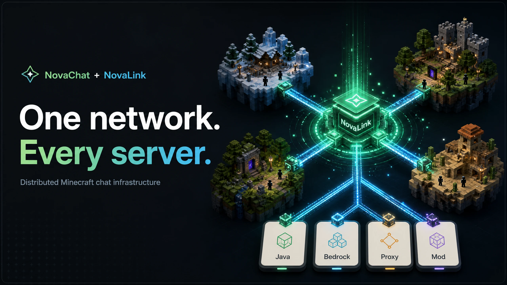
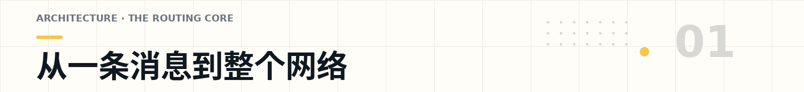
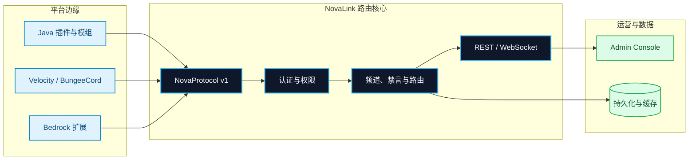
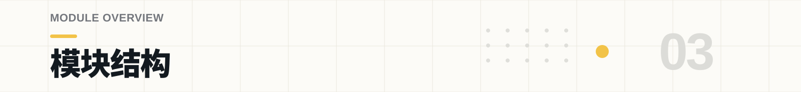
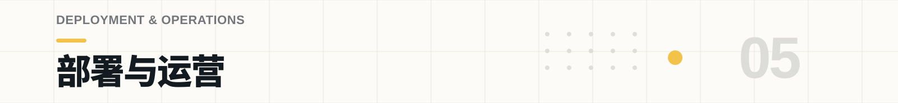

<p align="center">
  
</p>

<h1 align="center">NovaLink</h1>

<p align="center">
  <strong>一个网络。每一台服务器。</strong><br />
  为多端 Minecraft 社区准备的聊天路由、频道治理与运营控制基础设施。
</p>

<p align="center">
  <a href="#architecture">架构</a> ·
  <a href="#get-started">快速开始</a> ·
  <a href="#system-map">模块</a> ·
  <a href="#operations">部署</a> ·
  <a href="#build-verify">开发</a>
</p>

<p align="center">
  <a href="LICENSE"></a>
  
  
  
</p>

<p align="center">
  
</p>

> [!TIP]
> **NovaLink 是网络中心，NovaChat 是平台侧的接入层。** 你不需要让每一种服务端、代理或模组各自维护一套聊天逻辑；把它们接到同一个路由核心，协议、认证、频道、消息与运营边界就有了统一的归宿。

## 为多端服务器网络而生

当一个社区同时有 Java 服务端、代理、Bedrock 服务端和模组环境时，聊天往往最先失控：同一条公告要复制好几遍，权限规则散在不同配置里，频道状态跟着平台走，排查问题时也没人说得清消息到底经过了哪里。

NovaLink 的目标很直接：**把平台差异留在边缘，把网络规则留在中心。** 所有 NovaChat 客户端通过 **NovaProtocol v1** 接入同一个后端；一条消息只需要知道自己来自哪里、属于哪个频道、谁有资格收到它，剩下的由路由核心处理。

### 你会得到什么

| 你不必再维护的麻烦 | NovaLink 负责的事情 | 对运营意味着什么 |
| --- | --- | --- |
| 每个平台一套聊天、权限和频道逻辑 | 认证、转发、禁言、持久化与访问控制集中在后端 | 规则改一次，而不是逐端追着改 |
| 公告、世界聊天和私聊互相串线 | `GLOBAL`、`SERVER`、`WORLD` 与 `PRIVATE` 明确划分边界 | 聊天范围可解释、可审计、可治理 |
| 只靠日志猜网络状态 | REST、WebSocket 与管理面板提供统一控制入口 | 日常观测与运营不再依赖临时脚本 |

<a id="architecture"></a>
<p align="center">
  
</p>

从平台看，NovaChat 只是一个熟悉的插件、模组或扩展；从网络看，它们都在说同一种协议。这样做不是为了把每个端做得一模一样，而是为了让它们在接入后遵守同一套网络规则。



依赖方向也保持克制：共享协议层给后端和客户端共同使用；客户端运行时只服务于插件与模组；中心后端只依赖共享协议层，不把任何平台 API 带进核心服务。这样一来，平台可以继续演进，网络边界却不会被拖散。

### 后端短暂离线，不该让每个端都靠人盯着

接入端的运行时会处理握手、KeepAlive、连接状态和重连策略。意外断开时，它会按指数退避等待后再次连接，延迟从 1 秒逐步增长并封顶在 30 秒；连续多次失败后停止重试并留下明确日志。显式停止则不会偷偷重连——这是一次真正的关闭，而不是一次事故。

这套机制不取代你的监控系统，但能让网络恢复时不必逐个服务端手动“救火”。详细的连接生命周期、平台边界与重连约定见 [`NovaChat/client-core/DESIGN.md`](NovaChat/client-core/DESIGN.md)。

<a id="get-started"></a>
<p align="center">
  
</p>

第一次接入不需要先理解所有模块。先让中心后端跑起来，再把平台客户端对准它；其余能力可以随着你的网络逐步打开。

### 01 — 构建中心后端

```bash
git clone https://github.com/XingLingQAQ/NovaLink.git
cd NovaLink

# Linux / macOS
./gradlew :StarLink:core:shadowJar

# Windows PowerShell
.\gradlew.bat :StarLink:core:shadowJar
```

构建完成后，可直接运行的 fat JAR 位于 `StarLink/core/build/libs/*-all.jar`。它包含 NovaLink 后端所需依赖，因此不需要额外拼装运行时。

### 02 — 先定义你的网络边界

```bash
cp examples/novalink.yml novalink.yml
```

先从示例配置开始，再替换 `server.secret-key`、数据库凭据与 `clients` 中的客户端凭据。小型或本地环境可以使用 `sqlite` 或 `memory`；当网络开始承载真实玩家时，请换成持久化存储、限制允许访问的 IP/CIDR，并把密钥交给受控配置管理系统。

```yaml
server:
  bind-address: 0.0.0.0
  port: 8888
  websocket-port: 8889
  secret-key: "replace-with-a-long-random-secret"

database:
  type: sqlite
  sqlite:
    file-path: data/novalink.db

clients:
  - username: "survival"
    password: "replace-with-a-password-hash"
    display_name: "Survival"
```

### 03 — 启动后端，再接入平台客户端

```bash
# 默认读取当前工作目录中的 novalink.yml
java -jar StarLink/core/build/libs/*-all.jar

# 或显式指定配置文件
java -jar StarLink/core/build/libs/*-all.jar /opt/novalink/novalink.yml
```

默认示例使用 `8888` 作为 NovaProtocol TCP 端口、`8889` 作为 WebSocket 端口。选择目标平台的 NovaChat 模块，将其放入插件、模组或扩展目录，然后以 [`examples/novachat-config.yml`](examples/novachat-config.yml) 对齐主机、端口、用户名和密码。

> [!IMPORTANT]
> 示例里的密码、JWT 密钥、数据库账号和 Webhook 地址都只是占位符。它们能帮助你启动，但不能直接进入生产环境。

<a id="system-map"></a>
<p align="center">
  
</p>

仓库并不只有一个后端 JAR。下面这张地图的作用不是让你记住目录，而是帮你在需要改动时更快找到“应该改在哪里”。

| 当你想处理…… | 先看这里 | 它负责什么 |
| --- | --- | --- |
| 协议、数据包、提及或扩展 | [`NovaChat/common`](NovaChat/common) | NovaProtocol 编解码、提及与物品展示辅助、扩展加载、事件与命令注册。 |
| 插件端连接、状态与重连 | [`NovaChat/client-core`](NovaChat/client-core) | 连接生命周期、退避重连、请求跟踪、频道状态与格式工具。 |
| 认证、路由、数据与运营 API | [`StarLink/core`](StarLink/core) | 规范 Java 后端，负责会话认证、频道路由、持久化、REST 与 WebSocket。 |
| 管理控制面 | [`Panel/web`](Panel/web) | React + Vite 管理面板，用于登录、观测和日常运营操作。 |
| 真实环境验证 | [`e2e`](e2e) | 可选的真实服务器、机器人与多平台端到端验证编排。 |

### 已覆盖的平台边缘

| 平台族 | 目录 | 接入形态 |
| --- | --- | --- |
| Bukkit / Spigot / Paper / Folia | `NovaChat/Plugin` | Java 服务端插件。 |
| Velocity / BungeeCord | `NovaChat/Proxy` | Java 代理端插件。 |
| Fabric / NeoForge / Quilt | `NovaChat/MOD` | 共享模组层与 Loader 实现。 |
| Nukkit / PowerNukkitX | `NovaChat/Bedrock` | Java Bedrock 服务端插件。 |
| LeviLamina / PocketMine-MP / Endstone | `NovaChat/Bedrock` | C++、PHP 与 Python 生态扩展。 |
| Sponge | `NovaChat/Sponge` | Sponge 平台插件。 |

> [!NOTE]
> Minecraft、Loader、JDK 与上游 API 的组合始终在变化。这里列出的是仓库中的接入模块，不等于对每个版本组合做了无条件承诺。部署前请以对应模块的 `build.gradle`、`plugin.yml` 或平台文档为准，并在目标环境完成验证。

<a id="channels"></a>
<p align="center">
  
</p>

频道不只是聊天窗口的名字。在 NovaLink 里，频道就是消息该走到哪里、谁能看到、谁能管理的边界。先把范围说清楚，后续的权限、禁言、世界限制和私密会话才有稳定的落点。

| 频道范围 | 适合放什么 | 路由边界 |
| --- | --- | --- |
| `GLOBAL` | 全网公告、跨服公共聊天 | 所有已授权且连接的客户端。 |
| `SERVER` | 单服务端本地频道 | 指定 NovaChat 客户端内。 |
| `WORLD` | 资源世界、PVP 世界、子世界聊天 | 指定服务端及 `allowed_worlds` 范围。 |
| `PRIVATE` | 玩家创建或受控的私密会话 | 频道成员与权限边界内。 |

当运营需要介入时，中心后端可以在同一条边界上处理认证、权限、禁言、踢出和路由决定，而不必先判断消息来自哪一种服务端。频道、模板、客户端与全局权限都由 `novalink.yml` 定义；完整字段、数据库选项与功能开关见 [`examples/novalink.yml`](examples/novalink.yml)。

### 聊天不止是“把一段文字发出去”

共享协议层已经为提及、物品展示、格式模板和扩展留好了位置。它们的共同目标是让不同平台收到同一条消息时，仍能保留一致的语义，而不是只剩下一段被降级的纯文本。具体的展示方式依然应由各平台自己决定——毕竟玩家看到的是平台 UI，而不是网络协议。

<a id="operations"></a>
<p align="center">
  
</p>

NovaLink 可以从一台本地服务器开始，也可以随着社区规模把数据、反向代理和控制面拆开。关键不是一开始就把部署做得复杂，而是让每一步都有清晰的边界。

### 后端与数据层

| 组件 | 你需要知道的事 | 适合的起点 |
| --- | --- | --- |
| NovaLink 后端 | Java 17+；`StarLink/core` 会产出可直接运行的 fat JAR | 先在本地或测试环境跑通一条端到端消息。 |
| 数据存储 | 可按配置选择 MySQL/MariaDB、PostgreSQL、SQLite、Redis 与内存模式 | 本地可从 SQLite 起步；生产环境请选持久化方案。 |
| 平台客户端 | 不同模块会使用 Java、PHP、Python 或原生工具链 | 先从你网络中最重要的一类服务端开始接入。 |

### Admin Console

管理面板位于 [`Panel/web`](Panel/web)，用 React + Vite 构建。它是后端控制面的入口，不是另外一套聊天系统：登录后，前端通过 REST 与 WebSocket 连接同一个 NovaLink 网络。

```bash
cd Panel/web
npm ci
npm run dev

# 生产构建
npm run build
```

登录页默认向同源 `/api` 发起 REST 请求，并使用当前主机的 `8889` 端口建立 WebSocket 连接。**Advanced Settings** 可以在当前会话中覆盖这两个地址。生产部署时，请显式配置反向代理的 API 与 WebSocket 转发，并避免将认证端点暴露在不可信网络中。

<a id="build-verify"></a>
<p align="center">
  
</p>

如果你准备改协议、路由或平台适配，先把最接近改动的验证跑起来。下面的命令按从日常构建到真实环境验证的顺序排列；不需要为了改一处文案就启动一套真实 Minecraft 集群。

| 你要确认什么 | 命令 |
| --- | --- |
| 全仓能否正常构建 | `./gradlew build` |
| 常规静态检查是否通过 | `./gradlew check` |
| NovaLink 后端行为是否通过测试 | `./gradlew :StarLink:core:test` |
| 后端 JAR 是否可产出 | `./gradlew :StarLink:core:shadowJar` |
| Admin Console 是否可生产构建 | `cd Panel/web && npm run build` |
| 真实服务端链路是否可跑通 | `./gradlew realE2E` |

项目同时维护单元、属性、集成和真实服务端 E2E 的分层验证路径。真实 E2E 是显式选择的任务，需要真实 Minecraft 服务端文件、机器人进程、Node.js、匹配的 JDK 与平台运行环境；它很有价值，但不应被当作每次本地修改都必须执行的脚本。环境前提和编排方式见 [`e2e/README.md`](e2e/README.md) 与 [`docs/REAL-SERVER-E2E.md`](docs/REAL-SERVER-E2E.md)。

## 项目资源与协作

| 如果你正在…… | 从这里开始 |
| --- | --- |
| 调整后端、频道、客户端或权限配置 | [`examples/novalink.yml`](examples/novalink.yml) |
| 配置某个 NovaChat 接入端 | [`examples/novachat-config.yml`](examples/novachat-config.yml) |
| 理解客户端运行时的设计边界 | [`NovaChat/client-core/DESIGN.md`](NovaChat/client-core/DESIGN.md) |
| 修改或部署管理面板 | [`Panel/web`](Panel/web) |
| 准备真实服务器验证 | [`e2e/README.md`](e2e/README.md) |
| 从快速接入、部署、运维或 API 文档开始 | [`docs/README.md`](docs/README.md) |
| 查阅架构、测试、国际化与 UX 记录 | [`docs`](docs) |

贡献前，先在 [Issues](https://github.com/XingLingQAQ/NovaLink/issues) 中看看是否已有类似需求、缺陷或平台兼容性讨论。提交 PR 时，说明你影响了哪些平台、改了哪些配置、跑过什么验证，以及还有哪些已知限制。也请不要把真实密码、JWT 密钥、数据库凭据、私有 IP 或生产 Webhook 放进 Issue、示例配置或测试日志。

## 许可证

NovaLink 以 [MIT License](LICENSE) 发布。你可以在遵守许可证的前提下使用、修改和分发它；如果它帮你的服务器网络少踩了一点坑，也欢迎把改进带回来。
