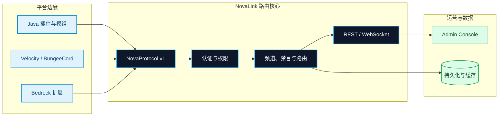

<p align="center">
  
</p>

<h1 align="center">NovaLink</h1>

<p align="center">
  <strong>一个网络。每一台服务器。</strong><br />
  面向 Minecraft 多端生态的分布式聊天、频道路由与运营控制基础设施。
</p>

<p align="center">
  <a href="#architecture">架构</a> ·
  <a href="#get-started">快速开始</a> ·
  <a href="#system-map">模块</a> ·
  <a href="#operations">部署</a> ·
  <a href="#build-verify">开发</a>
</p>

<p align="center">
  <a href="LICENSE"></a>
  
  
  
</p>

<p align="center">
  
</p>

> [!TIP]
> **NovaLink 是规范 Java 后端。** NovaChat 在平台侧接入，NovaLink 在网络中心统一处理协议、认证、频道、消息路由、持久化与运营控制。

## 为多端服务器网络而生

Minecraft 网络通常同时运行 Java 服务端、代理、Bedrock 服务端与模组环境。若各端分别维护聊天逻辑、权限和频道状态，跨服通信很快会变成难以审计的点对点耦合。NovaLink 采用星型拓扑，让所有 NovaChat 客户端通过 **NovaProtocol v1** 接入同一个路由核心；平台差异被留在边缘，业务边界留在中心。

| 一个路由核心 | 四种频道范围 | 多端一致的运营面 |
| --- | --- | --- |
| 将认证、转发、禁言、持久化和访问控制集中到 NovaLink 后端。 | `GLOBAL`、`SERVER`、`WORLD` 与 `PRIVATE` 覆盖公共、局部、世界与私密会话。 | React 管理面板通过 REST 与 WebSocket 查看运行状态并进行操作。 |

<a id="architecture"></a>
<p align="center">
  
</p>



依赖关系同样保持单向：共享协议层供所有端复用；平台客户端在其之上复用连接运行时；中心后端只依赖共享协议层，不把平台插件逻辑带入核心服务。

<a id="get-started"></a>
<p align="center">
  
</p>

### 01 — 构建中心后端

```bash
git clone https://github.com/XingLingQAQ/NovaLink.git
cd NovaLink

# Linux / macOS
./gradlew :StarLink:core:shadowJar

# Windows PowerShell
.\gradlew.bat :StarLink:core:shadowJar
```

构建完成后，可直接运行的 fat JAR 位于 `StarLink/core/build/libs/*-all.jar`。该产物已包含 NovaLink 后端运行所需依赖。

### 02 — 明确你的网络边界

```bash
cp examples/novalink.yml novalink.yml
```

从示例开始时，请先替换 `server.secret-key`、数据库凭据和 `clients` 中的客户端凭据。小型或本地环境可使用 `sqlite` 或 `memory`；生产环境应使用持久化存储、限制允许访问的 IP/CIDR，并把密钥放入受控配置管理系统。

```yaml
server:
  bind-address: 0.0.0.0
  port: 8888
  websocket-port: 8889
  secret-key: "replace-with-a-long-random-secret"

database:
  type: sqlite
  sqlite:
    file-path: data/novalink.db

clients:
  - username: "survival"
    password: "replace-with-a-password-hash"
    display_name: "Survival"
```

### 03 — 启动并连接平台客户端

```bash
# 默认读取当前工作目录中的 novalink.yml
java -jar StarLink/core/build/libs/*-all.jar

# 或显式指定配置文件
java -jar StarLink/core/build/libs/*-all.jar /opt/novalink/novalink.yml
```

默认示例使用 `8888` 作为 NovaProtocol TCP 端口、`8889` 作为 WebSocket 端口。选择目标平台的 NovaChat 模块，将其放入插件、模组或扩展目录，并以 [`examples/novachat-config.yml`](examples/novachat-config.yml) 对齐主机、端口、用户名和密码。

> [!IMPORTANT]
> 示例配置仅用于起步。不要将示例中的密码、JWT 密钥、数据库账号或 Webhook 地址直接用于生产环境。

<a id="system-map"></a>
<p align="center">
  
</p>

| 层级 | 路径 | 负责什么 |
| --- | --- | --- |
| **协议** | [`NovaChat/common`](NovaChat/common) | NovaProtocol 数据包、编解码、提及与共享扩展。 |
| **连接运行时** | [`NovaChat/client-core`](NovaChat/client-core) | 生命周期、重连策略与客户端状态，供插件与模组侧复用。 |
| **中心服务** | [`StarLink/core`](StarLink/core) | 规范 Java 后端，负责路由、认证、持久化、REST 与 WebSocket。 |
| **管理界面** | [`Panel/web`](Panel/web) | React + Vite 管理面板，用于登录、观测和运营控制。 |
| **验证基础设施** | [`e2e`](e2e) | 可选的真实服务器、机器人与多平台端到端验证编排。 |

### 已覆盖的平台边缘

| 平台族 | 目录 | 接入形态 |
| --- | --- | --- |
| Bukkit / Spigot / Paper / Folia | `NovaChat/Plugin` | Java 服务端插件。 |
| Velocity / BungeeCord | `NovaChat/Proxy` | Java 代理端插件。 |
| Fabric / NeoForge / Quilt | `NovaChat/MOD` | 共享模组层与 Loader 实现。 |
| Nukkit / PowerNukkitX | `NovaChat/Bedrock` | Java Bedrock 服务端插件。 |
| LeviLamina / PocketMine-MP / Endstone | `NovaChat/Bedrock` | C++、PHP 与 Python 生态扩展。 |
| Sponge | `NovaChat/Sponge` | Sponge 平台插件。 |

> [!NOTE]
> Minecraft、Loader、JDK 和上游 API 的组合会随平台发布节奏变化。部署前请以对应模块的 `build.gradle`、`plugin.yml` 或平台文档为准，并在目标环境完成验证。

<a id="channels"></a>
<p align="center">
  
</p>

| 频道范围 | 最适合的场景 | 路由边界 |
| --- | --- | --- |
| `GLOBAL` | 全网公告、跨服公共聊天 | 所有已授权且连接的客户端。 |
| `SERVER` | 单服务端本地频道 | 指定 NovaChat 客户端内。 |
| `WORLD` | 资源世界、PVP 世界、子世界聊天 | 指定服务端及 `allowed_worlds` 范围。 |
| `PRIVATE` | 玩家创建或受控的私密会话 | 频道成员与权限边界内。 |

频道、模板、客户端与全局权限均由 `novalink.yml` 定义。完整字段、数据库选项、功能开关与参考配置位于 [`examples/novalink.yml`](examples/novalink.yml)。

<a id="operations"></a>
<p align="center">
  
</p>

### 后端与数据层

| 组件 | 要求 | 说明 |
| --- | --- | --- |
| NovaLink 后端 | Java 17+ | `StarLink/core` 的生产后端和 fat JAR 运行路径。 |
| 数据存储 | 按需选择 | 支持 MySQL/MariaDB、PostgreSQL、SQLite、Redis 与内存模式。 |
| 平台客户端 | 因模块而异 | Java、PHP、Python 或原生工具链要求请查阅对应模块。 |

### Admin Console

管理面板位于 [`Panel/web`](Panel/web)，使用 React + Vite 构建：

```bash
cd Panel/web
npm ci
npm run dev

# 生产构建
npm run build
```

登录页默认向同源 `/api` 发起 REST 请求，并使用当前主机的 `8889` 端口建立 WebSocket 连接。**Advanced Settings** 可在当前会话中覆盖这两个地址。生产部署时，请显式配置反向代理的 API 与 WebSocket 转发，并避免将认证端点暴露在不可信网络中。

<a id="build-verify"></a>
<p align="center">
  
</p>

| 目标 | 命令 |
| --- | --- |
| 构建全部 Gradle 模块 | `./gradlew build` |
| 执行常规检查 | `./gradlew check` |
| 执行 NovaLink 后端测试 | `./gradlew :StarLink:core:test` |
| 生成 NovaLink fat JAR | `./gradlew :StarLink:core:shadowJar` |
| 构建 Admin Console | `cd Panel/web && npm run build` |
| 运行真实服务端 E2E | `./gradlew realE2E` |

真实服务端 E2E 是显式选择的验证路径，需要真实 Minecraft 服务端文件、机器人进程、Node.js、匹配的 JDK 与平台运行环境。下载校验、平台编排和环境前提请阅读 [`e2e/README.md`](e2e/README.md) 与 [`docs/REAL-SERVER-E2E.md`](docs/REAL-SERVER-E2E.md)。

## 项目资源与协作

| 资源 | 用途 |
| --- | --- |
| [`examples/novalink.yml`](examples/novalink.yml) | NovaLink 后端完整配置参考。 |
| [`examples/novachat-config.yml`](examples/novachat-config.yml) | NovaChat 客户端配置参考。 |
| [`NovaChat/client-core/DESIGN.md`](NovaChat/client-core/DESIGN.md) | 客户端核心模块的设计与依赖边界。 |
| [`Panel/web`](Panel/web) | 管理面板源码与构建入口。 |
| [`e2e/README.md`](e2e/README.md) | 真实服务端 E2E 环境与编排说明。 |
| [`docs`](docs) | 架构、测试、国际化与 UX 审查记录。 |

在提交贡献前，请先在 [Issues](https://github.com/XingLingQAQ/NovaLink/issues) 中检索或讨论需求、缺陷和平台兼容性问题。PR 应说明影响的平台、配置变化、验证命令以及已知限制；请勿在 Issue、示例配置或测试日志中提交真实密码、JWT 密钥、数据库凭据、私有 IP 或生产 Webhook。

## 许可证

本项目依据 [MIT License](LICENSE) 发布。
