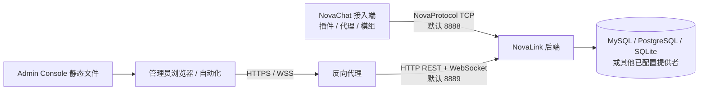

# 部署指南

NovaLink 的生产部署至少包含两个服务平面：供 NovaChat 接入端连接的 NovaProtocol TCP 服务，以及供 Admin Console 和外部集成使用的管理网关。后端在一个独立 Java 进程中装配网络、频道、认证、数据、REST 和 WebSocket 组件；管理面板是一个独立的 React + Vite 前端，通过 REST 与 WebSocket 访问同一后端控制面。[1] [2]

> **部署原则。** 先把网络边界、密钥、数据备份和回退路径设计清楚，再扩大端口暴露范围。NovaLink 不会自动替你提供 TLS 终止、负载均衡、数据库备份或密钥管理；这些属于部署环境的责任。

## 1. 推荐拓扑



接入端与后端之间的 TCP 链路应只对预先批准的服务端网络开放。管理网关的 WebSocket 端口同时接收 HTTP 认证、REST API 和 `/ws` 升级请求，因此应按控制面而非普通静态站点处理。[1] [3]

## 2. 服务组件与责任

| 组件 | 责任 | 运行建议 |
| --- | --- | --- |
| NovaLink 后端 JAR | 认证、频道、路由、持久化、REST、WebSocket、后端控制台 | 使用专用系统用户、受控工作目录、固定 JDK 与显式配置路径。 |
| 数据库提供者 | 保存后端状态与运营相关数据 | 使用独立凭据、备份、恢复演练与网络 ACL。 |
| NovaChat 接入端 | 将各 Minecraft 平台接入中心后端 | 与后端 `clients` 身份和允许 IP 一一核对。 |
| 反向代理 | TLS 终止、路径转发、访问控制、可选静态文件托管 | 必须同时正确转发 HTTP 与 WebSocket 升级流量。 |
| Admin Console | 面向管理员的控制面界面 | 建议通过受控 HTTPS 域名访问，不将开发服务器用于生产。 |

## 3. 后端运行方式

### 3.1 目录与权限

建议为后端建立一个不与源码工作树混用的运行目录：

```text
/opt/novalink/
├── novalink.jar
├── novalink.yml
├── data/
└── logs/
```

运行账户应只拥有该目录和所需数据路径的最小权限。将 `novalink.yml`、数据文件和日志分开存放有助于备份、轮换与事件响应；不要让构建用户、Web 进程和后端进程共享不必要的写权限。

### 3.2 启动命令

```bash
java -jar /opt/novalink/novalink.jar /opt/novalink/novalink.yml
```

后端允许通过首个参数指定配置文件位置；未提供时会从当前工作目录解析 `novalink.yml`。启动完成后会分别报告 TCP 与 WebSocket 网关的绑定地址和端口。[1]

### 3.3 端口与防火墙

| 服务 | 默认端口 | 面向对象 | 最小暴露建议 |
| --- | --- | --- | --- |
| NovaProtocol TCP | `8888` | 已批准的 NovaChat 接入端 | 只允许服务端、代理和已知私网网段。 |
| 管理网关 | `8889` | 反向代理或受控管理网络 | 优先仅允许反向代理或 VPN 网段；不要直接公开给未知来源。 |
| 管理面板静态站点 | 由部署方式决定 | 管理员浏览器 | 仅经 HTTPS 暴露，并配合身份与网络访问策略。 |

后端的 `security.allowed-ips` 是应用层连接限制；仍应在主机和网络层用安全组、防火墙或 ACL 实现纵深防御。[4]

## 4. 数据层选择与恢复责任

后端提供 MySQL、PostgreSQL、SQLite、Redis 和内存实现的选择路径。选择哪一种不是纯性能问题，还取决于数据持久性、备份、访问控制、可用性和恢复目标。[1] [5]

| 场景 | 可作为起点的选择 | 必须补齐的运维能力 |
| --- | --- | --- |
| 单机验证或小型网络 | SQLite | 数据文件备份、磁盘空间、文件权限、恢复演练。 |
| 多服务部署 | MySQL 或 PostgreSQL | 专用账号、加密连接、备份、监控、故障恢复和版本兼容性。 |
| 临时测试 | `memory` | 明确数据会在重启后丢失，不用于生产。 |
| Redis 相关场景 | 按当前提供者和架构确认 | 不把缓存当成唯一持久化副本。 |

无论选择哪一种，升级前都应先完成可恢复备份，并在非生产环境验证后端对备份数据的实际启动与读取行为。

## 5. 部署 Admin Console

面板源码位于 `Panel/web`，可通过以下命令完成生产构建：

```bash
cd Panel/web
npm ci
npm run build
```

前端默认优先使用同源 `/api` 访问 REST，并以当前主机的 `8889` 端口构造 WebSocket 地址；也支持通过环境变量或用户会话中的高级设置覆盖地址。生产环境中，建议让反向代理把面板域名下的 `/api` 与 WebSocket 升级请求转发到管理网关，从而避免浏览器访问不可达的内部端口。[2] [6]

> **反向代理检查点。** 代理必须保留 `Authorization` 头，正确处理 WebSocket 的 `Upgrade`/`Connection` 头，并将 `/api/auth/*`、其他 `/api/*` 与 `/ws` 都转发到同一管理网关。完成配置后，分别测试登录、普通 API 调用、WebSocket 认证和频道订阅。

## 6. 变更、升级与回退

生产变更应以可回退为目标，而非以“重启能成功”为目标。

| 阶段 | 必须完成的动作 | 通过条件 |
| --- | --- | --- |
| 变更前 | 记录当前 JAR、配置哈希、数据库备份、端口规则和已连接客户端 | 可在限定时间内恢复到当前版本。 |
| 预发布 | 在接近生产的环境构建、启动和接入至少一个目标平台 | 后端、认证、频道和管理面均可用。 |
| 发布 | 先部署后端，再按计划重连接入端，最后切换面板路由 | 监控无异常、客户端恢复、关键频道可用。 |
| 验证 | 查询 `status`、`clients`、`channels`，并进行受控消息测试 | 控制面与数据面均按预期工作。 |
| 回退 | 停止变更、恢复先前 JAR/配置/数据库或路由 | 明确记录原因，不掩盖数据兼容性问题。 |

配置热重载可减少部分变更的停机时间，但它不是对所有部署变更的替代：端口、进程、数据库迁移、代理规则和密钥轮换均需要独立的发布与回退设计。[7]

## 7. 部署完成后的最小验收

1. 检查后端日志是否已分别启动 TCP 与管理网关。
2. 从每个批准网络段连接一个 NovaChat 客户端，并确认后端显示为已认证。
3. 通过受控 HTTPS 地址完成一次管理面板登录与 WebSocket 连接。
4. 调用或通过面板查看频道、客户端与状态；确认 `Authorization` 和 WebSocket 升级均未被代理丢弃。
5. 在测试频道发送一条可识别的消息，验证接收范围符合频道设计。
6. 保存实际端口、版本、配置哈希和验证结果到变更记录。

详细凭据和网络控制要求见[安全基线](../operations/security.md)，日常操作见[运行手册](../operations/operations-runbook.md)。

## 参考资料

[1]: ../../StarLink/core/src/main/java/com/nova/link/NovaLinkMain.java "后端服务装配、端口与数据库提供者"
[2]: ../../README.md "Admin Console 与部署概览"
[3]: ../../StarLink/core/src/main/java/com/nova/link/websocket/WebSocketGateway.java "管理网关组装"
[4]: ../../examples/novalink.yml "服务器、端口与允许 IP 配置"
[5]: ../../StarLink/core/src/main/java/com/nova/link/config/DatabaseConfig.java "数据库配置模型"
[6]: ../../Panel/web/src/services/api.js "管理面板 API 与 WebSocket 地址解析"
[7]: ../../StarLink/core/src/main/java/com/nova/link/config/ConfigManager.java "配置监听、重载与同步"
