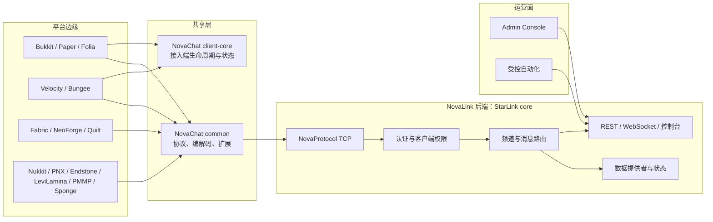

# 架构参考

NovaLink 的架构目标是把多种 Minecraft 平台的差异留在边缘，把认证、频道、消息路由、持久化和运营控制集中在后端。仓库通过共享协议层连接后端与接入端，同时保持生产后端与插件运行时之间的依赖隔离。[1] [2]

> **核心边界。** `NovaChat/common` 负责协议与通用能力；`NovaChat/client-core` 只服务于插件/模组接入端运行时；`StarLink/core` 是独立的生产后端。后端只能依赖共享协议层，不能反向依赖客户端运行时。[2]

## 1. 组件全景



此图表示责任边界，不表示所有平台模块采用完全相同的内部代码。接入端在平台 API、生命周期和线程模型上保留本地实现；共享层提供协议与可复用运行时能力，避免把 Minecraft 平台 API 带入后端核心。[1] [2]

## 2. Gradle 模块地图

`settings.gradle` 当前声明了共享层、后端、Bukkit/代理、Bedrock、Sponge 和多 Loader 模组子项目。非 Java 的 Bedrock 模块通过各自原生工具链接入，不应被当作与 Java 模块相同的 Gradle Java 子项目。[1] [3]

| 领域 | 位置 | 主要责任 |
| --- | --- | --- |
| 共享协议 | `NovaChat/common` | NovaProtocol 数据包、编解码、提及/物品展示辅助、扩展、事件与命令注册。 |
| 客户端运行时 | `NovaChat/client-core` | 接入端连接生命周期、重连策略、请求跟踪、频道/聊天状态和格式工具。 |
| 中心后端 | `StarLink/core` | Netty 服务端、认证、频道、路由、持久化、管理 API、WebSocket 与控制台。 |
| Java 平台接入 | `NovaChat/Plugin`、`Proxy`、`Sponge`、部分 `Bedrock` | 调用各自平台 API、承载本地命令/UI 与连接后端。 |
| 模组接入 | `NovaChat/MOD` | Fabric、NeoForge、Quilt 的共享/Loader 适配。 |
| 非 Java Bedrock 接入 | `NovaChat/Bedrock/endstone`、`levilamina`、`pmmp` | 由原生、PHP 或 Python 生态的工具链负责构建和运行。 |
| 管理面板 | `Panel/web` | React + Vite 前端，使用后端 REST 与 WebSocket。 |
| 真实 E2E | `e2e` | 平台真实服务端、机器人与后端的可选验证编排。 |

## 3. 依赖方向

```text
StarLink/core ───────────────► NovaChat/common
                                       ▲
平台插件 / 代理 / 模组 ────────────────┼──► NovaChat/client-core
                                       │
                                       └──► NovaChat/common
```

`client-core` 为接入端提供连接和状态工具，但并非后端库。将后端网络逻辑迁入 `client-core` 或从 `StarLink/core` 反向引用客户端类，会破坏平台隔离并把插件运行时依赖带入生产服务端。协议数据包和编解码留在 `common`，才可以由两侧安全共享。[2]

## 4. 后端启动与运行时装配

后端入口按以下顺序装配主要组件：解析配置、初始化认证与管理员、创建数据库提供者、加载频道、创建网络处理器和路由器、注册治理与频道动作处理器、启动 TCP 服务与管理网关，并在 JVM 关闭时执行清理。配置管理器同时启动文件监听，并在重载时更新配置化频道和已实现的功能开关。[4]

| 子系统 | 主要责任 | 关键边界 |
| --- | --- | --- |
| `AuthManager` / `IpBanManager` | 客户端与管理身份认证、认证失败保护 | 客户端身份不能替代控制面管理员身份。 |
| `ClientPermissionRegistry` | 客户端级全局频道权限 | 未显式配置时存在向后兼容的授权行为，生产应审阅。 |
| `ChannelManager` | 频道定义与成员关系 | 配置化频道和运行时私有频道的生命周期不同。 |
| `MessageRouter` / `MessagePipeline` | 路由与消息处理协作 | 频道、禁言/封禁、过滤、日志、跨服开关与 WebSocket 广播在此交汇。 |
| `DatabaseProvider` | 状态与运营数据提供者 | 由配置选择，不同提供者有不同持久化语义。 |
| `WebSocketGateway` | HTTP 认证、REST、WebSocket 会话与周期推送 | 是管理控制面网关，而非独立聊天后端。 |
| `BackendConsole` | 本地交互式管理 | 支持观察、治理、频道、公告、重载和停止操作。 |

## 5. 消息与控制面

NovaLink 的**数据面**是平台接入端通过 NovaProtocol 发送并接收的频道消息与相关动作；**控制面**是管理员通过控制台、REST、WebSocket 和 Admin Console 观察或修改系统状态。管理网关通过 `WebSocketGateway` 组合 HTTP 认证处理器、REST 处理器和 WebSocket 消息处理器，并把路由后的聊天消息转发给已经订阅相应频道的已认证会话。[4] [5]

| 流程 | 起点 | 核心处理 | 终点 |
| --- | --- | --- | --- |
| 平台接入 | NovaChat 接入端 | TCP 建连、握手、认证、权限引导 | 已认证客户端会话。 |
| 聊天路由 | 频道中的玩家消息 | 频道边界、治理状态、过滤、日志、扇出 | 目标平台接入端与对应 WS 订阅者。 |
| 配置变化 | 文件监听、控制台或 REST 重载 | 配置解析、运行时应用、配置同步 | 已连接客户端与运维日志。 |
| 管理操作 | Panel、自动化或本地控制台 | JWT/会话校验、REST/WS/控制台处理器 | 频道、玩家、客户端、通知或进程状态。 |

## 6. 频道作用域与隔离

后端的频道模型至少区分全局、服务端和私有边界。全局频道从 `global_channels` 创建，客户端频道绑定 `clientId`；当客户端配置把自己的频道写为 `GLOBAL` 时，后端会强制改为 `SERVER` 以保持跨客户端隔离。运行时私有频道不会被配置重载覆盖。[4]

这种模型意味着“名字相同”不等于“路由范围相同”。设计频道时应首先决定数据面边界、权限节点和世界条件，再决定客户端展示名称、格式或面板标签。

## 7. 管理面板的角色

`Panel/web` 不是第二套业务后端。它会经 REST 获取频道、玩家、设置和运营数据，并经 WebSocket 接收状态、频道、玩家、通知和已订阅聊天事件。前端默认使用同源 `/api` 与当前主机的 `8889` 端口建立 WebSocket，生产环境一般由反向代理提供稳定的外部入口。[6] [7]

## 8. 架构变更审阅问题

当变更影响任意一个模块时，请先回答以下问题：

| 问题 | 为什么重要 |
| --- | --- |
| 这是协议、接入端运行时还是后端业务能力？ | 决定代码应落在 `common`、`client-core` 还是 `StarLink/core`。 |
| 是否引入了后端到平台 API 的依赖？ | 会破坏生产后端的平台无关性。 |
| 是否改变认证、客户端权限或频道作用域？ | 可能扩大消息可见范围或控制面权限。 |
| 是否需要更新 REST/WS、配置或面板？ | 避免后端实现与控制面契约脱节。 |
| 是否需要增加真实环境验证？ | 多平台差异无法仅靠编译发现。 |

## 参考资料

[1]: ../../settings.gradle "NovaLink Gradle 子项目结构"
[2]: ../../NovaChat/client-core/DESIGN.md "三层架构与依赖方向"
[3]: ../../build.gradle "非 Java Bedrock 模块构建边界"
[4]: ../../StarLink/core/src/main/java/com/nova/link/NovaLinkMain.java "后端启动、服务装配与频道加载"
[5]: ../../StarLink/core/src/main/java/com/nova/link/websocket/WebSocketGateway.java "控制面网关与路由广播"
[6]: ../../Panel/web/src/services/api.js "面板 REST/WS 地址解析"
[7]: ../../Panel/web/src/contexts/WebSocketContext.jsx "面板实时状态消费"
