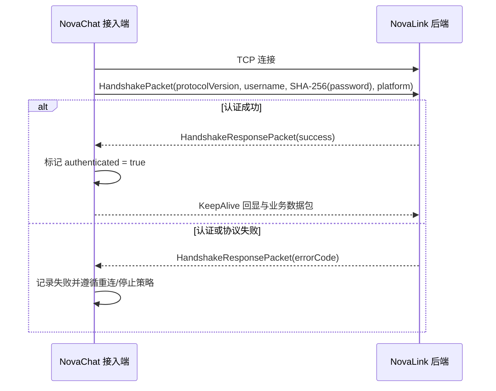

# NovaProtocol 与客户端接入参考

NovaProtocol 是 NovaLink 后端与 NovaChat 接入端之间的共享通信契约。协议数据包、注册表、编解码和帧处理位于 `NovaChat/common`；平台接入端再将这些能力包装进 Bukkit、代理、Bedrock、Sponge 或模组自己的生命周期与 API 中。[1] [2]

> **集成边界。** 本页描述仓库内接入端已采用的通用行为。它不是面向第三方实现者的“任意版本永久兼容承诺”，也不应替代对目标平台模块与目标 Minecraft 版本的真实环境验证。

## 1. 责任划分

| 层 | 位置 | 负责什么 | 不负责什么 |
| --- | --- | --- | --- |
| 共享协议层 | `NovaChat/common` | NovaProtocol 数据包、编解码、VarInt 帧、扩展与通用聊天辅助。 | 平台玩家 API、插件生命周期、主线程调度。 |
| 客户端运行时 | `NovaChat/client-core` | 连接配置、重连策略、密码哈希、请求跟踪、频道/聊天状态与部分共享网络引擎。 | 生产后端路由与数据库。 |
| 平台适配 | `NovaChat/Plugin`、`Proxy`、`Bedrock`、`Sponge`、`MOD` | 安装、平台事件、玩家 UI、命令、调度与平台特定配置。 | 改写后端的通用协议边界。 |
| 后端 | `StarLink/core` | 服务端 Netty、握手认证、频道、路由、治理、REST/WS。 | 使用接入端 `client-core` 作为依赖。 |

后端与接入端都依赖共享协议层，而生产后端不会依赖 `client-core`。这条依赖方向是避免平台 API 渗入中心服务的基本约束。[2]

## 2. 建连与握手

接入端的典型网络管线由 VarInt 帧处理、协议解码器、协议编码器和客户端处理器组成。TCP 建连成功后，接入端发送握手包；认证 Future 在收到握手响应后才完成，因此“socket 可连接”不是“客户端已经可用”。[2]



握手所携带的密码是 UTF-8 明文计算出的 SHA-256 十六进制摘要。后端注册客户端时兼容预先提供的 64 位哈希或配置中的普通密码，并将比较所需的值归一化；这解决的是协议兼容，不改变凭据应受控管理的要求。[2] [3]

| 握手字段 | 语义 | 集成注意事项 |
| --- | --- | --- |
| 协议版本 | 当前 NovaProtocol 版本 | 版本不匹配会导致握手失败；不要通过忽略错误强行继续通信。 |
| 用户名 | 后端 `clients` 配置中的身份 | 某些平台适配会在平台本地对用户名进行实例化处理，需保持后端配置一致。 |
| 密码摘要 | SHA-256 结果 | 接入端配置的密码必须与后端身份匹配；避免将真实值写入文档与日志。 |
| 平台类型 | 接入端声明的运行环境 | 用于后端会话元数据与平台差异处理。 |

## 3. KeepAlive 与连接状态

后端/接入端使用 KeepAlive 数据包维持会话可用性。接入端收到 KeepAlive 后会以相同时间戳和请求 ID 回显；该处理处于网络路径中，不应在普通玩家操作上阻塞它。[2]

接入端至少区分以下状态：

| 状态 | 含义 | 典型行动 |
| --- | --- | --- |
| TCP 已连接但未认证 | 网络已建立，正在等待握手 | 等待 `HandshakeResponsePacket`，不要把它展示为已上线。 |
| 已认证 | 可以处理后端授权的业务包 | 上报/维护频道与玩家状态，参与路由。 |
| 显式断开 | 插件停用或管理员主动停止 | 关闭通道与工作线程，不安排自动重连。 |
| 非预期断开 | 网络失败、后端不可达或通道关闭 | 清除连接/认证状态，按策略重连。 |

## 4. 非预期断线与重连

Java 插件接入端的共享重连约定使用指数退避：第 1 次等待约 1 秒，随后增长为 2、4、8、16 秒，最大不超过 30 秒；失败次数超过 10 次后停止自动重连并留下日志。显式停用不会触发这条路径。[2]

```text
attempt = 1  →  1s
attempt = 2  →  2s
attempt = 3  →  4s
attempt = 4  →  8s
attempt = 5  → 16s
attempt ≥ 6  → 30s 上限
attempt > 10 → 停止自动重连，等待人为干预
```

这是一种接入端可用性行为，而不是高可用架构的替代。后端故障、网络分区、凭据错误或协议不匹配仍应通过监控、日志和运维流程处理。因为各平台的调度器不同，实际“延迟”可能由秒、tick、异步执行器或事件循环实现；不要把一个平台的线程/调度假设套用到另一个平台。[2]

## 5. 平台覆盖与差异

仓库包含 Bukkit/Spigot/Paper、Folia、Velocity、BungeeCord、Nukkit、PowerNukkitX、Sponge、Fabric、NeoForge、Quilt，以及 Endstone、LeviLamina、PocketMine-MP 等接入目录。目录存在说明该适配位于仓库中，不等于每一种 Minecraft、JDK、Loader 和上游 API 组合都经过同等验证。[3] [4]

| 平台族 | 接入位置 | 接入实现需要自己处理的事项 |
| --- | --- | --- |
| Bukkit / Paper / Folia | `NovaChat/Plugin` | 插件生命周期、玩家消息、命令与线程/区域线程安全。 |
| Velocity / BungeeCord | `NovaChat/Proxy` | 代理生命周期、命令与代理调度。 |
| Fabric / NeoForge / Quilt | `NovaChat/MOD` | Loader 元数据、模组生命周期和不同网络 API。 |
| Nukkit / PNX | `NovaChat/Bedrock` | Java Bedrock 服务端的 API 与调度器。 |
| Endstone / LeviLamina / PMMP | `NovaChat/Bedrock` | 原生、PHP 或 Python 生态的构建与运行时。 |
| Sponge | `NovaChat/Sponge` | Sponge 插件生命周期与异步边界。 |

模组接入端使用与 Java 插件运行时不同的网络管线/API，属于需要单独审阅的差异路径。任何平台适配修改都应至少验证：建连、成功认证、认证失败、后端中断后的重连、KeepAlive、显式停用，以及对该平台特有玩家 API 的线程安全。[2]

## 6. 配置同步与频道状态

后端成功认证后可向客户端发送精简的配置同步，内容包括全局频道、模板和客户端频道/显示名，不包含密码。配置文件重载后也可对已连接客户端广播相同类型的同步数据。[5]

这要求客户端把“后台配置”与“平台本地 UI 状态”分开对待：后端同步可帮助更新频道视图，但平台显示格式、玩家线程、世界事件与本地命令的实现仍属于平台接入端职责。

## 7. 集成验收清单

| 验收项 | 合格信号 | 失败时首先检查 |
| --- | --- | --- |
| TCP 连通 | 接入端能完成网络连接 | 地址、端口、防火墙、允许 IP。 |
| 握手认证 | 后端和接入端均报告认证成功 | 用户名、密码、哈希方式、协议版本。 |
| KeepAlive | 会话保持活跃 | 网络线程阻塞、编解码、请求 ID 回显。 |
| 频道同步 | 客户端获得预期频道元数据 | 后端配置、重载日志、客户端解析。 |
| 消息路由 | 只在预期作用域接收 | 频道 ID、成员、权限、世界限制、跨服开关。 |
| 非预期断线 | 观察到受控退避重连 | 调度器、最大重试、后端日志与网络恢复。 |
| 显式停用 | 无偷偷重连或线程泄漏 | 生命周期回调、通道/工作线程关闭。 |

## 参考资料

[1]: ../../NovaChat/common "共享协议模块"
[2]: ../../NovaChat/client-core/DESIGN.md "客户端连接、握手、保活、重连与平台差异"
[3]: ../../settings.gradle "当前平台模块声明"
[4]: ../../README.md "平台接入模块概览"
[5]: ../../StarLink/core/src/main/java/com/nova/link/config/ConfigManager.java "ConfigSync 广播与脱敏序列化"
[6]: ../../StarLink/core/src/main/java/com/nova/link/NovaLinkMain.java "客户端凭据注册与握手权限引导"
