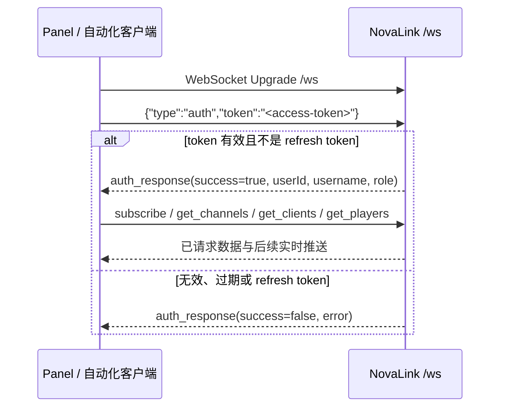

# 实时管理网关参考

NovaLink 的管理网关在 WebSocket 路径 `/ws` 上提供实时控制面数据。该通道服务于 Admin Console 或受控自动化：会话建立后必须先进行 JWT 鉴权，随后才能订阅频道聊天或查询频道、客户端和玩家状态。refresh token 不可用于 WebSocket 鉴权。[1] [2]

> **通道定位。** WebSocket 用于管理面实时观察与订阅，不替代 NovaChat 接入端的 NovaProtocol TCP 数据面。若要发送后台消息、治理玩家或修改配置，请使用受保护的 REST 接口或本地控制台。

## 1. 建连与认证时序

管理网关在配置的 WebSocket 端口提供 `/ws` 升级入口。浏览器客户端连接后应立即发送 `auth` 消息；只有会话被标记为 authenticated 后，频道订阅、状态查询和常规推送才可使用。[1] [3]



REST 使用的 access token 与 WebSocket 使用的 access token 应按同一安全基线保护。连接成功不代表鉴权成功；在收到成功的 `auth_response` 前，不应把会话视为可订阅或可操作状态。[2]

## 2. 客户端发送消息

| `type` | 是否要求已认证 | 最小字段 | 响应或效果 |
| --- | --- | --- | --- |
| `auth` | 否 | `token` | 返回 `auth_response`。 |
| `subscribe` | 是 | `channels` 数组 | 将会话订阅到给定频道，返回 `subscribed`。 |
| `unsubscribe` | 是 | `channels` 数组 | 移除频道订阅，返回 `unsubscribed`。 |
| `ping` | 否 | 无 | 返回 `pong` 和服务端时间戳。 |
| `get_channels` | 是 | 无 | 返回当前 `channel_update` 快照。 |
| `get_clients` | 是 | 无 | 返回当前 `server_status` 快照。 |
| `get_players` | 是 | 无 | 返回当前 `player_update` 快照。 |

### 认证

```json
{
  "type": "auth",
  "token": "<access-token>"
}
```

成功响应包含会话的 `userId`、`username`、`role` 与 `timestamp`；失败响应包含 `success: false` 与错误文本。令牌校验失败、缺失关键 claims 或使用 refresh token 都会导致认证失败。[1]

### 订阅与取消订阅

```json
{
  "type": "subscribe",
  "channels": ["global", "staff"]
}
```

```json
{
  "type": "unsubscribe",
  "channels": ["staff"]
}
```

订阅只影响对应 WebSocket 会话收到的 `chat` 推送。它不会让玩家加入频道、不会修改后端频道成员，也不会扩大 NovaChat 数据面的消息范围。[1]

### 即时查询与保活

```json
{"type": "get_channels"}
```

```json
{"type": "ping"}
```

`get_channels`、`get_clients` 和 `get_players` 返回与定期广播相同类别的快照消息。`ping` 返回 `pong` 和由服务端生成的 `timestamp`。前端实现还会在客户端侧维护自己的重连和心跳策略；外部自动化应独立处理网络中断、鉴权失败和重订阅。[1] [4]

## 3. 服务端推送消息

| `type` | 发送对象 | 核心字段 | 使用场景 |
| --- | --- | --- | --- |
| `auth_response` | 发起鉴权的会话 | `success`、`userId?`、`username?`、`role?`、`error?`、`timestamp` | 判断会话能否继续。 |
| `error` | 触发错误的会话 | `error`、`timestamp` | 缺少字段、未认证、未知类型或无效格式。 |
| `subscribed` / `unsubscribed` | 发起请求的会话 | `channels` | 确认本会话的订阅集合。 |
| `pong` | 发起 ping 的会话 | `timestamp` | 会话保活。 |
| `chat` | 已认证且订阅了该频道的活跃会话 | `channelId`、`senderId`、`senderName`、`content`、`server`、`timestamp` | 展示频道实时聊天。 |
| `server_status` | 所有已认证活跃会话 | `clients`、`totalConnections`、`timestamp` | 展示已认证游戏服务器状态。 |
| `channel_update` | 所有已认证活跃会话 | `channels`、`timestamp` | 展示频道清单和成员计数。 |
| `player_update` | 请求该快照的已认证会话 | `players`、`totalPlayers`、`timestamp` | 刷新玩家状态。 |
| `notification` | 所有已认证活跃会话 | `title`、`message`、`level`、`timestamp` | 呈现后端通知。 |

### `chat` 负载

```json
{
  "type": "chat",
  "channelId": "global",
  "senderId": "<uuid-or-system-id>",
  "senderName": "PlayerName",
  "content": "Hello network",
  "server": "survival",
  "timestamp": 1730000000000
}
```

后端会逐个检查会话是否已认证、活跃且订阅该 `channelId`，然后才推送聊天消息。因此，面板可见性由 WebSocket 订阅决定；游戏内消息可见性仍由后端频道路由决定。[1]

### `server_status` 与 `channel_update`

`server_status.clients` 中的每个客户端可能包含 `id`、`connectionId`、`remoteAddress`、`connectedAt`、`active`、`platform`、`version`、`ping` 和 `players`。`channel_update.channels` 则包含 `id`、`displayName`、`scope`、`clientId`、`memberCount` 和 `maxCapacity`。这些数据是运行时快照；界面不应把一次收到的结果当作永久配置事实。[1]

管理网关会在有活动会话时按周期广播服务器状态与频道更新；即时查询用于建立初始快照或按需刷新。[3]

## 4. 客户端状态机建议

| 状态 | 进入条件 | 客户端应做什么 |
| --- | --- | --- |
| `connecting` | 开始 WebSocket 连接 | 显示非阻塞连接中状态；不要发送受保护请求。 |
| `authenticating` | socket 打开，已发送 `auth` | 等待 `auth_response`。 |
| `connected` | 收到成功 `auth_response` | 恢复/发送订阅，拉取初始快照。 |
| `reconnecting` | 非预期关闭或心跳超时 | 采用有上限的退避，避免风暴重连。 |
| `failed` | 鉴权失败或重连预算耗尽 | 显示可操作错误；要求重新登录或检查网络。 |

不要把 token 刷新逻辑塞进每一条消息处理器。先确保 REST 刷新或重新登录成功，再建立新的 WebSocket 并完成 `auth`，最后重建订阅集合。[2] [4]

## 5. 安全与运维注意事项

1. 使用 `wss://`，并限制网关仅能从受控网络、反向代理或 VPN 到达。
2. 不在日志中打印完整 token、原始授权头或未脱敏消息内容。
3. 页面/自动化收到 `error` 时应分类处理，而不是把失败当作临时网络波动。
4. 订阅高流量频道前应评估面板与浏览器的缓存、渲染和日志策略。
5. 重连后必须重新认证和重订阅；不要依赖旧会话状态仍然存在。

完整控制面安全要求见[安全基线](../operations/security.md)，修改资源的接口请使用[管理 API](admin-api.md)。

## 参考资料

[1]: ../../StarLink/core/src/main/java/com/nova/link/websocket/WebSocketMessageHandler.java "WebSocket 入站消息、鉴权与广播负载"
[2]: ../../StarLink/core/src/main/java/com/nova/link/websocket/HttpAuthHandler.java "管理网关登录与刷新 token"
[3]: ../../StarLink/core/src/main/java/com/nova/link/websocket/WebSocketGateway.java "周期状态与频道广播"
[4]: ../../Panel/web/src/services/websocket.js "面板 WebSocket 重连与心跳实现"
